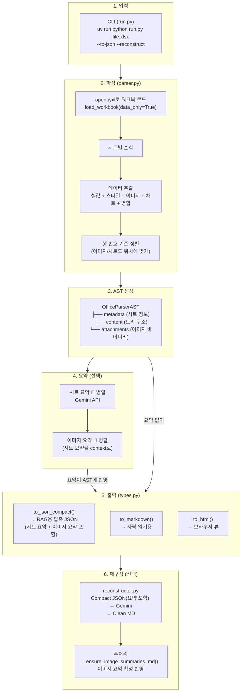

# Document Parser

PDF 및 Office(docx, pptx, xlsx) 문서에서 텍스트, 테이블, 이미지를 추출하고 Gemini 멀티모달 LLM으로 요약/엔티티를 생성하는 통합 도구입니다.
단일 파일 또는 폴더 내 문서 일괄 병렬 파싱을 지원하며, 파일 확장자에 따라 PDF / Office 파서를 자동 선택합니다.

## Why?

RAG(Retrieval-Augmented Generation) 파이프라인에서 가장 중요한 첫걸음은 **비정형 문서를 얼마나 정확하게 파싱하느냐**입니다.

실제 기업 환경의 문서는 단순 텍스트가 아닙니다. PDF에는 복잡한 테이블과 차트가 포함되어 있고, PowerPoint는 슬라이드별로 이미지와 다이어그램이 혼재하며, Excel은 여러 시트에 걸쳐 수식과 병합 셀이 얽혀 있습니다. 이러한 비정형 데이터를 제대로 파싱하지 않으면, 아무리 좋은 임베딩 모델과 LLM을 사용하더라도 RAG의 품질은 근본적으로 제한됩니다.

흔히 이 단계를 가볍게 여기거나 GenAI 모델에 전적으로 의존하는 경우가 있지만, 이는 명확한 한계가 있습니다. LLM은 테이블의 셀 구조를 정밀하게 인식하지 못하고, 이미지 내 텍스트를 놓치며, 문서의 레이아웃 정보(위치, 페이지 번호 등)를 보존하지 못합니다. 결국 **"Garbage In, Garbage Out"** — 파싱 품질이 전체 RAG 파이프라인의 상한선을 결정합니다.

물론 상용 문서 파싱 솔루션도 존재하지만, 다음과 같은 이유로 자체 구축이 필요한 경우가 많습니다:

- **도메인 특화**: 금융 보고서, 의료 문서, 기술 매뉴얼 등 도메인별 문서 구조에 맞는 커스터마이징이 필요
- **보안/컴플라이언스**: 민감한 내부 문서를 외부 SaaS로 전송할 수 없는 환경
- **파이프라인 통합**: 기존 데이터 파이프라인에 유연하게 통합하고 출력 형식을 제어해야 하는 경우
- **비용 최적화**: 대량 문서 처리 시 API 호출 비용 대비 자체 파싱이 경제적

이 프로젝트는 이러한 요구사항을 해결하기 위한 **production-ready 문서 파싱의 첫걸음**입니다. Docling 기반의 정밀한 PDF 파싱, AST 기반의 구조화된 Office 파싱, 그리고 Gemini LLM을 활용한 지능형 요약을 하나의 통합 도구로 제공합니다.

---

## 주요 기능

### PDF 파서 (`pdf_parser/`)
- **PDF 파싱**: [Docling](https://github.com/DS4SD/docling) 기반 고품질 PDF 변환
- **요소 추출**: 텍스트, 테이블, 이미지 자동 분리 + 바운딩 박스 위치 정보
- **이미지 분류**: DocumentFigureClassifier(EfficientNet-B0)로 16가지 카테고리 자동 분류
- **AI 요약**: Gemini로 페이지/이미지/테이블별 요약 + 엔티티 추출
- **테이블 분석**: TableFormer 모델로 셀 구조 분석 + LLM 카테고리 분류
- **HTML 메타데이터**: 파싱 결과를 구조화된 HTML 테이블 태그로 출력

### Office 파서 (`office_parser/`)
- **다중 포맷 지원**: docx, pptx, xlsx, odt, odp, ods, rtf
- **AST 기반 파싱**: 문서를 구조화된 AST(Abstract Syntax Tree)로 변환
- **다양한 출력**: JSON, Markdown, HTML, Text 형식 지원
- **이미지/차트 추출**: 첨부 이미지 및 차트 데이터 자동 추출
- **AI 요약**: Gemini로 이미지/슬라이드/시트 요약

### 공통
- **자동 분기**: 파일 확장자에 따라 PDF / Office 파서 자동 선택
- **일괄 처리**: 폴더 내 문서를 `ProcessPoolExecutor`로 병렬 파싱
- **Gemini 재구성**: Compact JSON → Gemini → Clean MD/HTML 변환 (Excel)
- **로그 저장**: `log/` 디렉토리에 실행 시각별 `.log` 파일 자동 생성

---

## 프로젝트 구조

```
doc-parser/
├── run.py                        # 통합 CLI 진입점 (PDF + Office)
├── main.py                       # 앱 엔트리포인트
├── mcp_server.py                 # FastMCP 기반 MCP 서버
├── pdf_parser/                   # PDF 파서 모듈
│   ├── __init__.py
│   ├── utils.py                  # bbox/위치 정보 헬퍼
│   ├── converter.py              # DoclingConverter, ParsedDocument
│   ├── summarizer.py             # GeminiSummarizer (병렬 LLM 요약)
│   └── markdown_builder.py       # MarkdownBuilder (HTML 메타 테이블 + 마크다운 조립)
├── office_parser/                # Office 파서 모듈
│   ├── __init__.py
│   ├── parser.py                 # OfficeParser (docx/pptx/xlsx/odt/rtf 파싱)
│   ├── types.py                  # AST 타입 정의 + 출력 변환 (to_json_compact, to_markdown, to_html)
│   ├── worker.py                 # 단일 파일 파싱 워커 + reconstruct 호출
│   ├── reconstructor.py          # Gemini 기반 JSON→MD/HTML 재구성
│   └── prompts.yaml              # reconstruct용 프롬프트 관리
├── docs/                         # 문서
│   └── test_docs/                # 테스트용 입력 문서 (xlsx, docx 등)
├── pdf_parser_docling.ipynb      # PDF 인터랙티브 노트북
├── log/                          # 실행 로그 (gitignore)
├── output/                       # 파싱 출력 ({파일명}_{모델명}/ 구조)
├── pyproject.toml                # uv 프로젝트 설정
└── README.md
```

---

## Excel 파싱 워크플로우

> Excel(.xlsx) 파일을 파싱하여 RAG용 Compact JSON, Markdown, HTML로 변환하는 전체 파이프라인입니다.

### 한 줄 요약

```
Excel 파일 → openpyxl로 파싱 → AST(트리 구조) 생성 → 포맷별 출력(JSON/MD/HTML) → (옵션) Gemini로 재구성
```

### 왜 AST를 사용하는가?

Excel은 단순한 표가 아닙니다. 실제 업무용 Excel은:
- 한 시트에 **여러 개의 표**가 섞여 있고
- **병합 셀**, **배경색으로만 구분되는 영역**이 있고
- **간트차트처럼 값 없이 색칠만 된 셀**이 있고
- **이미지, 차트**가 셀 사이에 끼어 있습니다

이걸 단순히 CSV로 변환하면 구조 정보가 전부 날아갑니다.
그래서 **AST(Abstract Syntax Tree)**라는 중간 표현을 거칩니다.

```
Excel의 복잡한 구조 → AST로 정규화 → 용도별 출력 포맷으로 변환
```

이 구조 덕분에 파싱 로직은 한 번만 작성하고, 출력 포맷(MD, HTML, JSON)은 독립적으로 추가할 수 있습니다.

### 전체 파이프라인



### 각 단계 상세

#### 2-1. 파싱 (parser.py → `_parse_xlsx()`)

Excel 파일을 열고 시트별로 데이터를 추출합니다.

**시트별 처리 순서:**

1. **이미지 추출** — `ws._images` 순회 → 포맷, 앵커 위치, 바이너리 데이터 추출
2. **차트 추출** — `ws._charts` 순회 → 차트 타입, 제목, 앵커 위치 추출
3. **테마 색상 추출** — 워크북 theme XML에서 색상 팔레트 추출 (인덱스 0↔1, 2↔3 교차 매핑)
4. **병합 셀 처리** — 주 셀: colspan 값 기록, 나머지 셀: 스킵 마킹
5. **셀 데이터 추출** — 값 + 스타일(배경색, 글자색, 볼드) 추출, 뒤쪽 빈 셀 제거
6. **위치 기반 정렬** — 이미지, 차트, 셀 행을 row 기준 정렬

> **중요:** 값이 없더라도 배경색이 있으면 유효한 셀로 취급합니다.
> 이유: 간트차트에서 진행 상태를 색칠로만 표현하는 패턴이 많기 때문입니다.

> **어두운 배경 + 어두운 글자** 조합은 자동으로 흰색 글자로 보정합니다.
> (`_luminance()` 함수로 밝기 계산 → 둘 다 < 0.4이면 글자색을 #FFFFFF로)

#### 2-2. AST 구조 (types.py)

파싱 결과는 트리 구조(AST)로 저장됩니다.

```
OfficeParserAST (최상위)
├── type: "xlsx"
├── metadata: OfficeMetadata
│   ├── title, author, created, modified
│   └── document_summary (Gemini 요약)
├── content: List[OfficeContentNode]  ← 트리의 본체
└── attachments: List[OfficeAttachment]  ← 이미지 바이너리
```

**OfficeContentNode** — 모든 콘텐츠는 이 하나의 타입으로 표현됩니다:

```python
@dataclass
class OfficeContentNode:
    type: str           # "sheet" | "row" | "cell" | "image" | "chart" | ...
    text: str           # 셀 값, 문단 텍스트 등
    children: List      # 하위 노드 (sheet→row→cell 계층)
    formatting: TextFormatting  # bold, italic 등
    metadata: Dict      # row번호, col번호, style, summary 등
```

**AST 트리 구조 예시:**

```
OfficeParserAST (type="xlsx")
│
├── content[0]: sheet (sheetName="WBS공정표")
│   ├── row (r=1)
│   │   ├── cell (col=1, text="범례")
│   │   ├── cell (col=2, text="완료", bg="#00B050")
│   │   └── cell (col=4, text="지연", bg="#FF0000")
│   ├── image (row=5, filename="WBS_image_0.png")
│   ├── row (r=4)
│   │   ├── cell (col=1, text="1")
│   │   └── cell (col=7, bg="#00B050")  ← 값 없이 색칠만 (완료 표시)
│   └── chart (chartType="BarChart", title="매출 추이")
│
└── attachments
    └── OfficeAttachment (filename="WBS_image_0.png", data=b"...")
```

**metadata 주요 정보:**

| 노드 타입 | metadata 키 | 설명 |
|---|---|---|
| **sheet** | `sheetName`, `maxRow`, `maxColumn`, `sheet_summary` | 시트 기본 정보 + 요약 |
| **row** | `row` | Excel 행 번호 (1-based) |
| **cell** | `row`, `col`, `colspan`, `style` | 위치, 병합, 스타일 정보 |
| **image** | `row`, `col`, `format`, `filename`, `image_summary` | 이미지 위치와 요약 |
| **chart** | `chartType`, `title`, `row` | 차트 타입과 위치 |

#### 2-3. 요약 파이프라인 (Gemini API)

`--no-summary`를 주지 않으면 자동으로 실행됩니다.

```
Step 1: 시트 요약 (병렬) → sheet.metadata["sheet_summary"]에 저장
Step 2: 이미지 요약 (병렬, Step 1 완료 후) → image.metadata["image_summary"]에 저장
```

시트 요약이 먼저 완료되어야 이미지 요약에 context로 전달할 수 있습니다.

#### 2-4. 출력 포맷

| 메서드 | 용도 | 특징 |
|---|---|---|
| `to_json_compact()` | RAG 입력 (권장) | 빈 셀 제거, col 번호 기반 매핑, 배경색/colspan 분리 |
| `to_markdown()` | 사람 읽기 | 파이프 테이블 형식 |
| `to_html()` | 브라우저 뷰 | CSS 테마 + 인라인 스타일 |

**Compact JSON 예시:**

```json
{
  "type": "xlsx",
  "sheets": [{
    "sheet_name": "WBS공정표",
    "summary": "WBS 공정표 시트 요약...",
    "rows": [
      {"r": 4, "cells": {"1": "1", "2": "기획"}, "bg": {"7": "#00B050"}},
      {"type": "image", "filename": "WBS_image_0.png", "summary": "이미지 요약..."}
    ]
  }]
}
```

> **왜 헤더를 key로 안 쓰나요?** 한 시트에 여러 표가 있으면 헤더가 여러 개입니다. col 번호는 절대 틀리지 않으므로 더 안전합니다.

#### 2-5. 재구성 (reconstructor.py)

`--reconstruct` 플래그를 주면 Compact JSON을 Gemini에게 보내서 깔끔한 MD/HTML로 재생성합니다.

```
Compact JSON → Gemini 2.5 Flash (시트별 병렬) → 후처리 → Clean MD/HTML
```

**Gemini가 하는 일:**
1. 한 시트의 여러 표를 의미 단위로 분리
2. 간트 배경색 → 범례 참조하여 텍스트 상태 변환 (예: `#00B050` → "완료")
3. 계층 구조를 들여쓰기/리스트로 표현
4. 빈 행/구분 행/의미없는 구분선 삭제
5. 원본 언어 유지 (번역하지 않음)

**이미지 요약 후처리 (`_ensure_image_summaries_md`):**

| 상황 | 처리 |
|---|---|
| Gemini가 `` 출력 | alt text를 `image_summary`로 교체 |
| Gemini가 이미지를 누락 | 문서 끝에 `` 추가 |
| `--no-summary` (요약 없음) | alt text = "이미지" (기본값) |

> 프롬프트는 `prompts.yaml`에 관리됩니다. 프롬프트를 수정하면 재구성 품질을 튜닝할 수 있습니다.

---

## "가짜 병합" 패턴

Excel에서 실제 셀 병합을 쓰지 않고 시각적으로 병합처럼 보이게 하는 패턴이 3가지 있습니다. 파서가 모두 처리합니다.

| 패턴 | 예시 | 처리 방법 |
|---|---|---|
| **빈 셀 그룹핑** | "모니터링" + 빈칸 2개 | JSON에서 빈 셀 자동 제거 → LLM이 문맥으로 이해 |
| **흰색 글씨 반복** | "2. 정확도" × 16행 | 파서는 그대로 추출, reconstruct 시 중복 제거 |
| **배경색만 연속** | 오렌지 좌측 바 (값 없음) | `bg` 필드로 보존 → reconstruct 시 섹션 구분 힌트 |

---

## 설치

```bash
uv sync
```

> **Apple Silicon**: DocumentFigureClassifier는 EfficientNet-B0 기반으로 CPU에서도 빠르게 동작합니다.

## 환경 설정

`.env` 파일에 Gemini API 키를 설정합니다:

```bash
GOOGLE_API_KEY=your_google_api_key
MODEL_ID=gemini-2.5-flash  # 기본 모델 (선택)
```

## 사용법

### CLI (run.py)

```bash
# ── PDF ──
uv run python run.py sample.pdf -o output
uv run python run.py sample.pdf -o output --table-mode fast

# ── Office ──
uv run python run.py report.docx -o output --to-markdown
uv run python run.py slides.pptx -o output --to-html

# ── Excel (Compact JSON + 재구성) ──
uv run python run.py data.xlsx -o output --to-json
uv run python run.py data.xlsx -o output --to-json --reconstruct

# ── 공통 ──
uv run python run.py ./docs/ -o output --workers 4     # 폴더 일괄 병렬 처리
uv run python run.py sample.pdf -o output --no-summary  # 요약 없이 추출만
uv run python run.py sample.pdf -o output -v             # 상세 로그
```

### CLI 옵션

| 옵션 | 기본값 | 설명 |
|------|--------|------|
| `input` | (필수) | 파일 또는 폴더 경로 |
| `-o`, `--output` | `output` | 출력 디렉토리 |
| `--workers` | `2` | 폴더 모드 시 병렬 처리 수 |
| `--no-summary` | `false` | LLM 요약 비활성화 |
| `--model-id` | `gemini-2.5-flash` | Gemini 모델 ID (`.env MODEL_ID`로도 설정 가능) |
| `--table-mode` | `accurate` | PDF TableFormer 모드 (`accurate` / `fast`) |
| `--to-markdown` | (기본) | Office 출력: Markdown |
| `--to-html` | | Office 출력: HTML |
| `--to-text` | | Office 출력: Text |
| `--to-json` | | Office 출력: Compact JSON (RAG 최적화) |
| `--reconstruct` | `false` | Gemini로 JSON→clean MD/HTML 재구성 |
| `-v`, `--verbose` | `false` | DEBUG 로그 출력 |

### Python 코드에서 직접 사용

#### PDF 파싱

```python
from pdf_parser.converter import DoclingConverter
from pdf_parser.summarizer import GeminiSummarizer
from pdf_parser.markdown_builder import MarkdownBuilder
from pathlib import Path

converter = DoclingConverter(table_mode="accurate")
parsed = converter.convert("sample.pdf")

output_dir = Path("output/sample")
output_dir.mkdir(parents=True, exist_ok=True)
parsed.save_assets(output_dir)

summarizer = GeminiSummarizer(model_id="gemini-2.5-flash")
page_summaries = summarizer.summarize_pages(parsed)
image_summaries = summarizer.summarize_figures(parsed, page_summaries)
table_summaries = summarizer.summarize_tables(parsed, page_summaries)

builder = MarkdownBuilder(parsed, output_dir)
final_md = builder.build(page_summaries, image_summaries, table_summaries)
Path("output/sample/sample_final.md").write_text(final_md, encoding="utf-8")
```

#### Office 파싱

```python
from office_parser import OfficeParser, OfficeParserConfig

config = OfficeParserConfig(
    summarize=True,
    gemini_model_id="gemini-2.5-flash",
)

ast = OfficeParser.parse_office("report.docx", config)

markdown = ast.to_markdown()
html = ast.to_html()
text = ast.to_text()
compact_json = ast.to_json_compact()
```

---

## 출력 구조

디렉토리명에 사용 모델이 포함되어 모델 간 비교가 용이합니다:

### Office (Excel/Word/PPT) 출력

항상 4가지 파일이 모두 출력됩니다:

```
output/{파일명}_{모델명}/
├── {파일명}_ast.json          # ① AST raw JSON (워크플로우 3단계)
├── {파일명}.md                # ② AST → 사람읽기용 Markdown (워크플로우 5단계)
├── {파일명}_compact.json      # ③ Compact JSON — 재구성 직전 (워크플로우 5단계)
├── {파일명}_reconstructed.md  # ④ Gemini 재구성 최종 MD (--reconstruct)
├── {파일명}_token_usage.json  # ⑤ 모델별 토큰 사용량 (in/out)
└── pictures/                  # 추출된 이미지
    └── ...
```

### PDF 출력

```
output/{파일명}_{모델명}/
├── {파일명}_text.md           # Raw 텍스트
├── {파일명}_final.md          # 최종 마크다운 (메타데이터 포함)
├── pictures/                  # 추출된 이미지
└── table/                     # 테이블 에셋
    ├── img/                   # 테이블 영역 이미지
    └── md/                    # 테이블 마크다운
```

예시: `output/AX_sample_gemini-2.5-flash/`, `output/AX_sample_claude-opus-4/`

## 포맷별 비교 (실측)

demo_irregular_v2.xlsx (1시트, WBS+매출+비용+의견 4개 표) 기준:

| 포맷 | 토큰 수 | 빈 셀 | 구조 정확도 | 용도 |
|---|---:|---|---|---|
| Raw MD | 2,575 | ~40% 빈 셀 패딩 | 테이블 파편화 | 사람 읽기 |
| Compact JSON | 3,826 | 0% (전부 제거) | col 위치 정확 | RAG 입력 / LLM 입력 |
| HTML | 9,355 | 스타일 오버헤드 | 시각적 완벽 | 브라우저 뷰 |
| Reconstructed MD | ~900 | 0% | Gemini가 정리 | RAG 최종 소스 |

---

## 출력 예시

### PDF

PDF 파싱 결과는 원본 문서의 구조를 최대한 보존하면서, 각 요소(페이지/이미지/테이블)에 대한 메타데이터를 HTML 테이블 태그로 삽입합니다.

**이미지 파싱 결과:**


- EfficientNet-B0 기반 분류기로 16가지 카테고리 판별
- 바운딩 박스(bbox) 좌표로 페이지 내 정확한 위치 정보 제공
- 페이지 요약을 컨텍스트로 전달하여 정확한 이미지 요약 생성

**테이블 파싱 결과:**


- TableFormer로 셀 구조(행/열/병합) 정밀 분석
- 테이블 내용 요약 + 카테고리 분류 수행

### PowerPoint


- AST 형태로 슬라이드 계층 구조 유지
- LibreOffice 환경에서 슬라이드 이미지 렌더링 → 시각적 요약 생성

### Excel


- 시트별 마크다운 테이블 변환, 셀 병합/수식 결과값 반영
- 시트별 요약 병렬 생성

---

## 에러 처리

파서는 **부분 실패를 허용**합니다. 하나가 실패해도 나머지는 계속 진행합니다.

| 실패 상황 | 동작 |
|---|---|
| 이미지 바이너리 추출 실패 | 노드는 생성, 요약만 스킵 |
| 차트 제목 파싱 실패 | title = None, chartType만 기록 |
| 셀 스타일 추출 실패 | style = None으로 진행 |
| Gemini 요약 실패 | 해당 요약만 스킵, 로그 경고 |
| 테마 색상 추출 실패 | 빈 리스트로 진행 (테마색 무시) |
| Reconstruct 시트 실패 | 해당 시트만 `<!-- Reconstruct failed -->` 처리 |
| Reconstruct 전체 실패 | 로그 에러, 재구성 MD 미생성 (원본 출력은 영향 없음) |

---

## PDF 출력 메타데이터 형식

최종 마크다운(`_final.md`)은 구조화된 HTML 메타데이터 테이블을 포함합니다:

- **페이지** (`<table class="page-meta">`): `page_number`, `page_summary`, `entities`
- **이미지** (`<table class="figure-meta">`): `image_id`, `category`, `page_number`, `image_summary`, `entities`, `bbox`, `img_source`
- **테이블** (`<table class="table-meta">`): `table_id`, `category`, `page_number`, `table_summary`, `entities`, `bbox`, `img_source`

## 이미지 분류 카테고리 (16종)

`bar_chart` · `bar_code` · `chemistry_markush_structure` · `chemistry_molecular_structure` · `flow_chart` · `icon` · `line_chart` · `logo` · `map` · `other` · `pie_chart` · `qr_code` · `remote_sensing` · `screenshot` · `signature` · `stamp`

## 테이블 카테고리 (LLM 분류)

`financial_statement` · `comparison` · `statistics` · `performance_metrics` · `configuration` · `schedule` · `pricing` · `inventory` · `survey_results` · `reference` · `other`

---

## 지원 파일 형식

| 형식 | 확장자 | 파서 |
|------|--------|------|
| PDF | `.pdf` | `pdf_parser` (Docling) |
| Word | `.docx` | `office_parser` |
| PowerPoint | `.pptx` | `office_parser` |
| Excel | `.xlsx` | `office_parser` |
| OpenDocument | `.odt`, `.odp`, `.ods` | `office_parser` |
| RTF | `.rtf` | `office_parser` |

## 요구사항

- Python 3.12+
- Google Cloud API 키 (Gemini 모델 액세스)
- macOS / Linux (Windows는 WSL 권장)
- Office 파서의 슬라이드 이미지 변환 시 LibreOffice 필요 (선택)

### LibreOffice 설치 (선택)

PowerPoint 슬라이드를 이미지로 변환하여 AI 요약을 생성할 때 필요합니다. 설치하지 않아도 텍스트 기반 파싱은 정상 동작합니다.

```bash
# macOS
brew install --cask libreoffice

# Ubuntu / Debian
sudo apt install libreoffice

# Amazon Linux / RHEL
sudo yum install libreoffice
```

## 로깅

실행 시 `log/` 디렉토리에 타임스탬프 기반 로그 파일이 자동 생성됩니다:

```
log/
├── 20260311_221500.log
└── ...
```

로거 네임스페이스:
- `doc_parser` — 메인 CLI (파일 탐색, 전체 결과 요약)
- `pdf_parser` — PDF 파싱 관련
- `office_parser` — Office 파싱 관련

---

## MCP 서버

이 프로젝트는 [FastMCP](https://gofastmcp.com) 기반 MCP(Model Context Protocol) 서버를 제공합니다. Claude Desktop, Kiro, Cursor 등 MCP 클라이언트에서 문서 파싱 기능을 직접 호출할 수 있습니다.

### 제공 Tool

| Tool | 설명 |
|------|------|
| `parse_document` | 단일 문서(PDF/Office) 파싱 → 마크다운/HTML/텍스트 출력 |
| `parse_directory` | 폴더 내 문서 일괄 병렬 파싱 |
| `list_supported_formats` | 지원 형식 목록 조회 |

### 실행 방법

```bash
# stdio 모드 (기본 — MCP 클라이언트용)
uv run python mcp_server.py

# streamable-http 모드 (HTTP 기반 클라이언트용)
uv run python mcp_server.py http

# 호스트/포트 변경
MCP_HOST=127.0.0.1 MCP_PORT=9000 uv run python mcp_server.py http
```

### MCP 클라이언트 설정

#### Claude Desktop

`~/Library/Application Support/Claude/claude_desktop_config.json`:

```json
{
  "mcpServers": {
    "doc-parser": {
      "command": "uv",
      "args": ["run", "python", "mcp_server.py"],
      "cwd": "/path/to/doc-parser"
    }
  }
}
```

#### Kiro

`.kiro/settings/mcp.json`:

```json
{
  "mcpServers": {
    "doc-parser": {
      "command": "uv",
      "args": ["run", "python", "mcp_server.py"],
      "cwd": "/path/to/doc-parser"
    }
  }
}
```

#### Streamable HTTP 클라이언트

`uv run python mcp_server.py http`로 서버를 먼저 실행한 후:

```json
{
  "mcpServers": {
    "doc-parser": {
      "url": "http://localhost:8000/mcp"
    }
  }
}
```

### MCP Inspector로 테스트

#### stdio 모드

```bash
MCP_SERVER_REQUEST_TIMEOUT=600000 npx @modelcontextprotocol/inspector uv run python mcp_server.py
```

#### streamable-http 모드

```bash
# 터미널 1: 서버 실행
uv run python mcp_server.py http

# 터미널 2: Inspector 실행
npx @modelcontextprotocol/inspector
```

Inspector UI(`http://localhost:6274`)에서:
1. Transport Type → `Streamable HTTP` 선택
2. URL에 `http://localhost:8000/mcp` 입력
3. Advanced Configuration에서 Request Timeout을 `600000`(10분)으로 변경
4. Connect → Tools 탭에서 테스트

#### curl로 테스트

```bash
# tool 목록 조회
curl -X POST http://localhost:8000/mcp \
  -H "Content-Type: application/json" \
  -H "Accept: application/json, text/event-stream" \
  -d '{"jsonrpc":"2.0","id":1,"method":"tools/list"}'

# 단일 문서 파싱
curl -X POST http://localhost:8000/mcp \
  -H "Content-Type: application/json" \
  -H "Accept: application/json, text/event-stream" \
  -d '{"jsonrpc":"2.0","id":2,"method":"tools/call","params":{"name":"parse_document","arguments":{"file_path":"/path/to/document.pdf","no_summary":true}}}'
```

---

## 라이선스

이 프로젝트는 MIT 라이선스로 자유롭게 수정 및 배포 가능합니다. 자세한 내용은 LICENSE 파일을 참조해 주시기 바랍니다.
