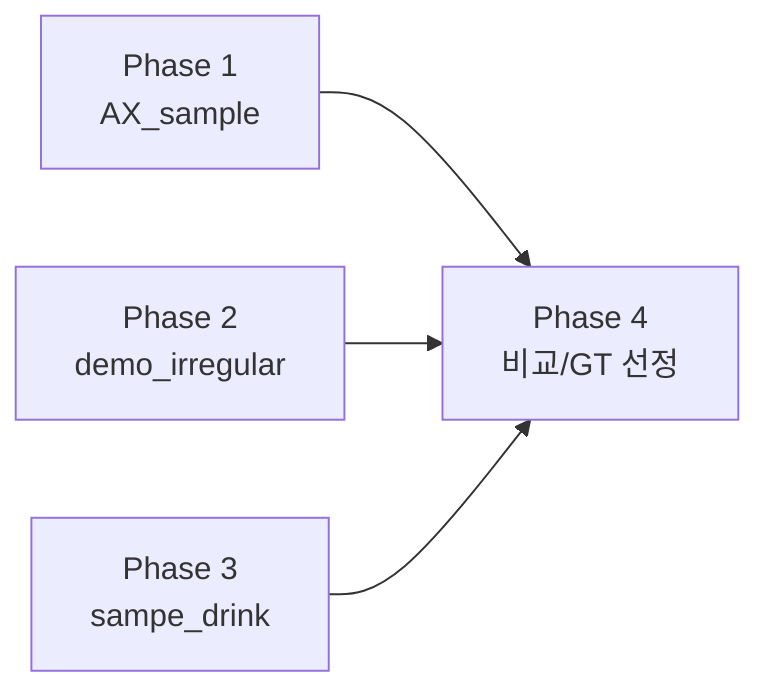

# Sprint 01 — GT Benchmark (Gemini 모델 비교)

**상태**: 완료 (2026-03-19)
**생성일**: 2026-03-19

## 목표

Gemini 2.5 Flash와 Gemini 2.5 Pro를 사용하여 Excel 파싱 GT(Ground Truth)를 생성하고 모델 간 품질을 비교한다.
코드 수정 없이 `--model-id` 옵션만 변경하여 동일 문서에 대해 병렬 테스트를 수행한다.

## 조건

- **코드 수정 없음** — 모델 ID만 교체
- **요약 비활성화** — `--no-summary` (시트/이미지 요약 모두 스킵)
- **병렬 실행** — Flash와 Pro를 동시에 실행하여 시간 절약
- **출력 구조** — `output/{파일명}_{모델명}/` 네이밍 규칙 적용
- **토큰 사용량 추적** — 모델별 in/out 토큰을 `_token_usage.json`으로 기록

## 테스트 대상 문서

| 파일 | 경로 | 특징 |
|------|------|------|
| AX_sample.xlsx | `docs/test_docs/AX_sample.xlsx` | 사장님보고용, 복잡한 표/병합/간트 |
| demo_irregular_v2.xlsx | `docs/test_docs/demo_irregular_v2.xlsx` | 비정형 다중 표, 가짜 병합 패턴 |
| sampe_drink.xlsx | `docs/test_docs/sampe_drink.xlsx` | 음료 데이터, 일반 표 구조 |

## 테스트 모델

| 모델 | ID | 특징 |
|------|------|------|
| Gemini 2.5 Flash | `gemini-2.5-flash` | 빠른 속도, 비용 효율 |
| Gemini 2.5 Pro | `gemini-2.5-pro` | 고품질, 복잡한 문서에 강점 |

## Phase 요약

| Phase | 내용 | 산출물 |
|-------|------|--------|
| 1 | Flash/Pro 병렬 실행 (AX_sample) | output/{파일}_{모델}/ |
| 2 | Flash/Pro 병렬 실행 (demo_irregular_v2) | output/{파일}_{모델}/ |
| 3 | Flash/Pro 병렬 실행 (sampe_drink) | output/{파일}_{모델}/ |
| 4 | 결과 비교 및 GT 선정 | 비교 분석 기록 |

## 실행 명령어 템플릿

```bash
# Flash와 Pro 병렬 실행 (요약 비활성화, reconstruct 포함)
uv run python run.py docs/test_docs/{파일}.xlsx -o output --model-id gemini-2.5-flash --no-summary --reconstruct &
uv run python run.py docs/test_docs/{파일}.xlsx -o output --model-id gemini-2.5-pro --no-summary --reconstruct &
wait
```

## 출력 파일 (모델별)

```
output/{파일명}_{모델명}/
├── {파일명}_ast.json          # AST raw JSON
├── {파일명}.md                # 사람읽기용 Markdown
├── {파일명}_compact.json      # Compact JSON (재구성 입력)
├── {파일명}_reconstructed.md  # Gemini 재구성 최종 MD
├── {파일명}_token_usage.json  # 토큰 사용량 (in/out)
└── pictures/                  # 추출 이미지
```

## 의존 관계



Phase 1~3은 독립적이므로 병렬 수행 가능. Phase 4는 모든 결과가 나온 후 수행.

## 진행 규칙

- 각 Phase 완료 시 이 문서의 Phase 상태를 업데이트
- Phase 내 작업 단위는 하나의 커밋으로
- 최종 GT로 선정된 결과물은 별도 마킹
- 비교 시 주요 관점: 테이블 구조 정확도, 병합 셀 처리, 간트차트 해석, 요약 품질
