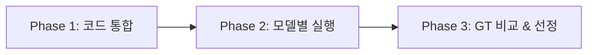

# Sprint 02 — OpenRouter 모델 벤치마크

**상태**: 진행 중
**브랜치**: `test/glm`
**기간**: 2026-03-19 ~

## 목표

OpenRouter에서 접근 가능한 텍스트 성능 우수 모델을 Gemini 2.5 Pro GT와 비교하여,
GT에 가장 근접한 모델을 선정한다.

## 후보 모델

| # | 모델 | OpenRouter ID | 특징 |
|---|------|--------------|------|
| 1 | Qwen 3.5 Plus | `qwen/qwen3.5-plus-02-15` | 하이브리드 아키텍처, 높은 텍스트 품질 |
| 2 | GLM-4.7 Flash | `zhipu/glm-4.7-flash` | 30B급, 에이전틱 코딩 최적화 |
| 3 | GPT-OSS-120B | `openai/gpt-oss-120b` | 117B MoE, 무료, 131K 컨텍스트 |

## GT (Ground Truth)

- **모델**: Gemini 2.5 Pro
- **결과 위치**: `output/AX_sample_gemini-2.5-pro/`
- **선정 근거**: Sprint 01 Phase 4 — 6개 메트릭 중 5개에서 Flash 대비 우위

## 테스트 문서

- `docs/test_docs/AX_sample.xlsx` (10 sheets, 복잡 테이블/병합/간트)

## Phase 요약

| Phase | 이름 | 설명 | 의존 |
|-------|------|------|------|
| 1 | OpenRouter 코드 통합 | `worktree-qwen` → `test/glm` 브랜치에 코드 cherry-pick | 없음 |
| 2 | 모델별 파싱 실행 | 3개 모델로 AX_sample reconstruct 실행 | Phase 1 |
| 3 | GT 대비 수동 비교 | 6개 메트릭 기준 수동 평가 및 최종 모델 선정 | Phase 2 |

## 평가 기준 (Sprint 01과 동일)

1. **테이블 구조 정확도** — 올바른 행/열/헤더 계층
2. **병합 셀 처리** — colspan/rowspan 표현
3. **간트 차트 해석** — 색상 코드 → 시맨틱 상태 텍스트
4. **정보 손실** — 데이터 보존 완전성
5. **가독성** — Markdown 시맨틱 마크업 (볼드, ` `, 인용 등)
6. **토큰 효율** — 문서당 비용 비율

## 의존 관계

## 진행 규칙

- Phase 내 작업은 하나의 커밋으로 묶는다
- 각 모델 출력은 `output/AX_sample_{model_short}/`에 저장
- GT 비교는 reconstructed MD 기준으로 수행
