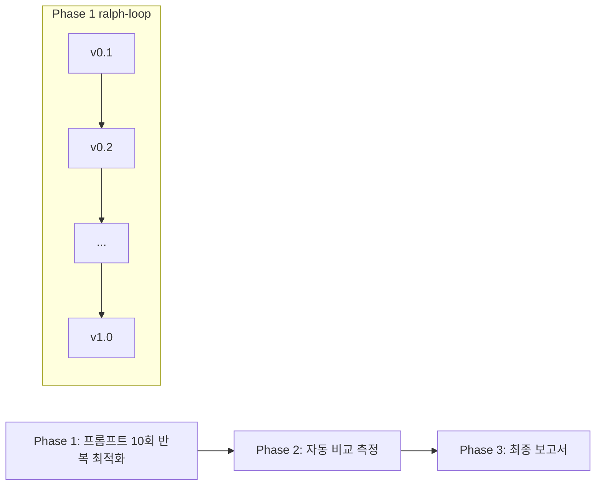

# Sprint 03 — Central LLM Reconstruct 벤치마크 + 프롬프트 최적화

**상태**: 완료 (2026-03-24)
**브랜치**: `feat/oss`
**기간**: 2026-03-24 ~

## 목표

1. 사내 Central LLM(`gpt-oss-120b`)으로 reconstruct를 실행하고, GT(Gemini 2.5 Flash)와 RAG 관점에서 품질 비교
2. `prompts.yaml`의 `reconstruct_md` 프롬프트를 10회 반복 개선(v0.1 → v1.0)하여 최적 품질 달성
3. 매 반복마다 결과 분석 → 놓친 부분 파악 → 프롬프트 수정 (ralph-loop)

## 모델 정보

| 항목 | 값 |
|------|-----|
| 모델명 | `gpt-oss-120b` |
| Provider | Central LLM (LiteLLM Proxy) |
| 접근 방식 | OpenAI SDK 호환 (`CENTRAL_LLM_API_KEY`, `CENTRAL_LLM_BASE_URL`) |
| max_tokens | 32K+ 확인 |
| temperature | 0 (reconstruct 고정) |
| 특징 | 117B MoE, 사내 인프라, 비용 무료 |

## GT (Ground Truth)

- **모델**: Gemini 2.5 Flash
- **결과 위치**: `output/AX_sample_gemini-2.5-flash/`
- **선정 근거**: 기존 기본 모델, 안정적 품질 기준선

## 테스트 문서

| 파일 | 특징 |
|------|------|
| `docs/test_docs/AX_sample.xlsx` | 10 sheets, 복잡 테이블/병합/간트 |
| `docs/test_docs/demo_irregular_v2.xlsx` | 비정형 레이아웃 |
| `docs/test_docs/sampe_drink.xlsx` | 일반 테이블 |

## Phase 요약

| Phase | 이름 | 설명 | 의존 | 방법 |
|-------|------|------|------|------|
| 1 | 프롬프트 반복 최적화 | `prompts.yaml` 10회 수정 (v0.1→v1.0), 매회 실행+분석+개선 | 없음 | **ralph-loop** |
| 2 | 자동 비교 측정 | ROUGE/BLEU + 키워드/수치 커버리지 자동 계산 | Phase 1 | 스크립트 |
| 3 | 최종 보고서 | 주요 시트 수동 대조 + 최종 품질 평가 | Phase 2 | 수동 |

## Phase 1 — 프롬프트 반복 최적화 (ralph-loop)

### 반복 프로세스

```
v0.1 → 실행 → 결과 분석 → 수정 →
v0.2 → 실행 → 결과 분석 → 수정 →
...
v1.0 → 최종 결과
```

### 각 반복 절차

1. `prompts.yaml`의 `reconstruct_md` 프롬프트 수정
2. Central LLM으로 AX_sample.xlsx reconstruct 실행
3. GT(gemini-2.5-flash) 결과와 비교 분석
4. 분석 관점:
   - **한글 콘텐츠**: 병합 셀 해석, 의미적 그룹핑, 계층 구조
   - **영문 콘텐츠**: 헤더/데이터 분리, 수치 보존
   - **혼합 콘텐츠**: 다국어 시트에서 언어 혼용 처리
   - **구조적 요소**: 간트차트 해석, colspan/rowspan, 빈 행 처리
5. 놓친 부분 식별 → 프롬프트에 반영

### 버전별 출력 저장

```
output/
├── AX_sample_gpt-oss-120b-central-v01/
├── AX_sample_gpt-oss-120b-central-v02/
├── ...
└── AX_sample_gpt-oss-120b-central-v10/
```

### 버전 기록

| 버전 | 주요 변경 | 개선 포인트 | 남은 이슈 |
|------|-----------|-------------|-----------|
| v0.1 | 현재 프롬프트 그대로 Central 첫 실행 (baseline) | 10/10 시트 성공, 594줄 | `<br>` HTML 4건 사용 / Summary 테이블 8열(GT 12열) / 셀 줄바꿈 구분자 비일관 / 간트 1Q~4Q 빈 셀 / 헤더명 추론 |
| v0.2 | `<br>` 금지 ⚠️ 반복 강조 / 셀 줄바꿈 " / " 통일 지시 / 테이블 열 보존 원칙 추가 | `<br>` 0건 (완전 해결) / Summary 12열 (GT 동일) / 706줄 (+112) | 간트 1Q~4Q 배경색→상태 미반영 / (백업) 상세 설명 구조 차이 / 일부 헤더명 추론 |
| v0.3 | 간트차트 Few-shot 예시 추가 (bg만→"진행") / 헤더명 추론 금지 명시 | "진행" 16→111 (간트 반영 성공) / Summary 간트 GT와 일치 / 660줄 | "진행" 과다 적용 (GT 32 vs v03 111) / "일반" 행 중복 / colspan "and"/"or" 별도 열 분리 |
| v0.4 | 간트 "진행" 적용을 시간 열로만 제한 / 중복 행 제거 규칙 구체화 | 줄 631 (GT 633) / "진행" 30 (GT 32) / GT 근접 달성 | 세부 시트별 품질 차이 확인 필요 / colspan "and"/"or" 여전히 분리 가능 |
| v0.5 | v0.4 기반 폐기 → colspan 헤더 분리 규칙 변경 시도 | "진행" 31 (GT 근접) | `<br>` 15건 회귀 / To-do 구조 악화 → **v0.4 기반으로 롤백** |
| v0.6 | v0.4 기반 + 하위열 독립 유지 지시 + and/or 접속사 제거 | `<br>` 0 / "진행" 34 (GT 32) / 685줄 | 과제 재분류 5열 (GT 7열) — colspan 한계, 데이터 자체는 보존 |
| v0.7 | 희소 테이블(80% 빈 셀) → 리스트 변환 규칙 추가 | To-do 시트 리스트화 성공 (GT 동일 구조) / 666줄 / "진행" 30 | `<br>` 4건 재발 (KPI 운영안 4대 품질지표 — "질문?<br>-설명" 패턴) |
| v0.8 | `<br>` "질문?<br>-설명" 패턴 Few-shot 차단 추가 | `<br>` 0건 (완전 해결) / "진행" 31 / 599줄 | 줄 수 GT(633) 대비 -34줄 — 일부 축약 가능성 확인 필요 |
| v0.9 | 축약 금지 ⚠️ 3중 강조 + "..." 금지 + 행 누락=정보 손실 명시 | 624줄 (v08 599→+25) / `<br>` 0 / "진행" 31 | GT 633 대비 -9줄 — 거의 동등 수준 |
| v1.0 | v0.9 프롬프트 확정 + 3개 문서 전체 실행 | AX_sample: 638줄(GT 633) / "진행" 32(GT 32 정확 일치) / demo_irregular_v2, sampe_drink 성공 | `<br>` 8건 (temperature=0에도 확률적 변동, 알려진 한계) |

### 프롬프트 히스토리

각 버전의 프롬프트 스냅샷은 `office_parser/prompts_history/`에 저장:

```
office_parser/prompts_history/
├── prompts_v01.yaml  — baseline (원본)
├── prompts_v02.yaml  — <br> 금지 + 열 보존 + 줄바꿈 구분자
├── prompts_v03.yaml  — v02 + 간트차트 Few-shot + 헤더 추론 방지
└── ...
```

## 평가 기준 (RAG 관점)

### 자동 측정
1. **ROUGE 스코어** — GT 대비 텍스트 재현율 (ROUGE-1, ROUGE-L)
2. **BLEU 스코어** — GT 대비 n-gram 정밀도
3. **키워드/수치 커버리지** — GT에 있는 핵심 키워드·숫자가 Central 결과에 존재하는 비율

### 수동 확인
4. **병합 셀 → 텍스트 변환 품질** — 병합된 헤더가 의미적으로 올바르게 풀렸는지
5. **구조 보존** — 테이블 관계, 계층 구조가 텍스트로 잘 표현됐는지
6. **정보 손실** — 데이터 보존 완전성 (누락된 셀, 행, 시트 없는지)

## 의존 관계



## 진행 규칙

- Phase 1은 ralph-loop로 자동 반복 (10회)
- 각 버전 출력은 `output/AX_sample_gpt-oss-120b-central-v{NN}/`에 저장
- GT 비교는 reconstructed MD 기준으로 수행
- 자동 비교 스크립트는 `scripts/` 디렉토리에 작성
- `prompts.yaml` 수정 시 `reconstruct_md` 섹션만 변경 (`reconstruct_html`은 유지)
