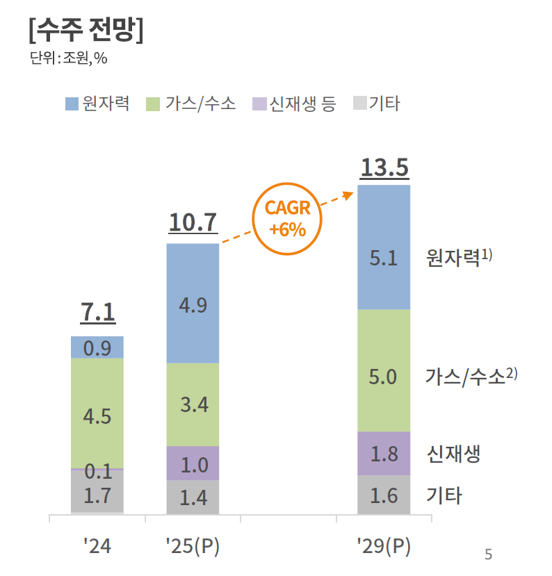

## To‑do List  
**상품상품기획팀 신선MD유통채널 관련 1Q 주요 To‑do List 정리**

---

### 1. 상품 유형 분류 (AOP/LRP 연계 + Rebaseline)

| Task | Jan W1 | Jan W2 | Jan W3 | Jan W4 | Feb W1 | Feb W2 | Feb W3 | Feb W4 | Mar W1 | Mar W2 | Mar W3 | Mar W4 |
|------|--------|--------|--------|--------|--------|--------|--------|--------|--------|--------|--------|--------|
| **1‑1. 상품 분류 기준 품질개선/공유용 자료 작성** |  |  |  |  |  |  |  |  |  |  |  |  |
|  1) 분류 기준 품질개선 – 매장 공유 가능 수준 |  |  |  |  |  |  |  |  |  |  |  |  |
|    - 프리미엄, 2 vs PB상품: 주력 영업전략과의 연계성 여부 판단 기준은? |  |  |  |  |  |  |  |  |  |  |  |  |
|    - 프리미엄 vs 일반: 프로세스 리뉴얼 여부 판단 기준은? |  |  |  |  |  |  |  |  |  |  |  |  |
|  2) 분류 원칙 수립 – 필요 여부 확인 필요 |  |  |  |  |  |  |  |  |  |  |  |  |
|    - 프리미엄, 2, 3 비중 정의? |  |  |  |  |  |  |  |  |  |  |  |  |
|    - 이외 방안 고민 필요 |  |  |  |  |  |  |  |  |  |  |  |  |
|  3) 공유 Material 작성 / 품질개선 |  |  |  |  |  |  |  |  |  |  |  |  |
| **1‑2. 기존 상품 재정의 공유용 자료 작성** |  |  |  |  |  |  |  |  |  |  |  |  |
|  1) 재정의 가이드라인 – 매장 공유 가능 수준 |  |  |  |  |  |  |  |  |  |  |  |  |
|    - 어떻게 프레시푸드 그룹핑/통합하면 되는가? |  |  |  |  |  |  |  |  |  |  |  |  |
|    - 어떻게 의미 재해석하면 되는가? |  |  |  |  |  |  |  |  |  |  |  |  |
|  2) 공유 Material 작성 / 품질개선 |  |  |  |  |  |  |  |  |  |  |  |  |
| **1‑3. 카테고리 특화 / 생산 공통 / 매장관리 공통 분류 가이드 작성** |  |  |  |  |  |  |  |  |  |  |  |  |
|  1) 카테고리 특화 기준 |  |  |  |  |  |  |  |  |  |  |  |  |
|  2) 생산 공통 기준 |  |  |  |  |  |  |  |  |  |  |  |  |
|  3) 매장관리 공통 기준 |  |  |  |  |  |  |  |  |  |  |  |  |
|    - 가맹점 매장관리 공통은 “상품 없애라” 가이드라인? |  |  |  |  |  |  |  |  |  |  |  |  |
| **1‑4. 가이드 매장 전달 및 수합** |  |  |  |  |  |  |  |  |  |  |  |  |
|  1) 가이드 전달 및 설명 |  |  |  |  |  |  |  |  |  |  |  |  |
|  2) 매장 분류, 재정의 수행 |  |  |  |  |  |  |  |  |  |  |  |  |
|  3) 결과 취합 |  |  |  |  |  |  |  |  |  |  |  |  |
| **1‑5. 매장‑본사 품평회 및 최종안 도출** |  |  |  |  |  |  |  |  |  |  |  |  |
|  1) 본사‑매장 품평회 |  |  |  |  |  |  |  |  |  |  |  |  |
|  2) 최종안 도출 |  |  |  |  |  |  |  |  |  |  |  |  |
| **1‑6. SCM to‑do list 정의** |  |  |  |  |  |  |  |  |  |  |  |  |
|  1) 분류 작업 관련 SCM To‑do list 정리 |  |  |  |  |  |  |  |  |  |  |  |  |

---

### 2. 상품별 품질지표 설정 / 관리 체계 정의

| Task | Jan W1 | Jan W2 | Jan W3 | Jan W4 | Feb W1 | Feb W2 | Feb W3 | Feb W4 | Mar W1 | Mar W2 | Mar W3 | Mar W4 |
|------|--------|--------|--------|--------|--------|--------|--------|--------|--------|--------|--------|--------|
| **2‑1. 품질지표 관리 한판 정의** |  |  |  |  |  |  |  |  |  |  |  |  |
|  1) 상품 단계별 품질지표 List 정의 |  |  |  |  |  |  |  |  |  |  |  |  |
|    - 상품 단계 정의 필요: 상품기획 / 시식테스트 & 시범판매 / 상품개발 / 매장적용 / 품질개선 |  |  |  |  |  |  |  |  |  |  |  |  |
|    - 품질지표 List 정의: 출시일정, 조리기술 퍼포먼스, 재무 성과, 사용자 만족도 |  |  |  |  |  |  |  |  |  |  |  |  |
|    - 원천 조리기술 R&D(예: RFM, Physical 식품) 상품에 대한 품질지표 설정 수준은? |  |  |  |  |  |  |  |  |  |  |  |  |
|    - 생산공통 상품에 대한 레시피북 품질지표 부여 방식은? |  |  |  |  |  |  |  |  |  |  |  |  |
|  2) 상품 Pillar별 품질지표 항목 정의 |  |  |  |  |  |  |  |  |  |  |  |  |
|    - Biz: 매출 (단, 제품 경쟁력/품질 등은 어떻게 반영?) |  |  |  |  |  |  |  |  |  |  |  |  |
|    - Ops/WW: 비용 or 인력 (단, 인력 쏠림 현상 예상되는데 어떻게 방지?) |  |  |  |  |  |  |  |  |  |  |  |  |
| **2‑2. 품질지표 관리 체계 정의** |  |  |  |  |  |  |  |  |  |  |  |  |
|  1) 상품별 관리 수준 정의 |  |  |  |  |  |  |  |  |  |  |  |  |
|    - 본사 관리 빈도 |  |  |  |  |  |  |  |  |  |  |  |  |
|    - 본사 관리 항목 … |  |  |  |  |  |  |  |  |  |  |  |  |
|    - 본사 참여 수준 … |  |  |  |  |  |  |  |  |  |  |  |  |
| **2‑3. 매장 상품별 본사 관리 품질지표 정의 / 합의** |  |  |  |  |  |  |  |  |  |  |  |  |
|  1) 매장 1차안 도출 (항목 Level) |  |  |  |  |  |  |  |  |  |  |  |  |
|  2) 본사‑매장 품평회 및 합의 |  |  |  |  |  |  |  |  |  |  |  |  |
|  3) 매장 타깃치 도출 |  |  |  |  |  |  |  |  |  |  |  |  |
|  4) 본사‑매장 타깃치 품평회 및 합의 |  |  |  |  |  |  |  |  |  |  |  |  |
| **2‑4. 품질지표 → 매장목표 연결 가이드라인 전달?** |  |  |  |  |  |  |  |  |  |  |  |  |
|  1) HR 조직에 식품 품질지표 → 매장목표 연결 가이드라인 수립 / 전달 |  |  |  |  |  |  |  |  |  |  |  |  |
| **2‑5. SCM to‑do list 정의** |  |  |  |  |  |  |  |  |  |  |  |  |
|  1) 품질지표 작업 관련 SCM To‑do list 정리 |  |  |  |  |  |  |  |  |  |  |  |  |

---

### 3. 전국확대

| Task | Jan W1 | Jan W2 | Jan W3 | Jan W4 | Feb W1 | Feb W2 | Feb W3 | Feb W4 | Mar W1 | Mar W2 | Mar W3 | Mar W4 |
|------|--------|--------|--------|--------|--------|--------|--------|--------|--------|--------|--------|--------|
| **3‑1. 생산 공통 전국확대 레시피북 정립** |  |  |  |  |  |  |  |  |  |  |  |  |
|  1) 레시피북 관리 항목 / 요소 정의 |  |  |  |  |  |  |  |  |  |  |  |  |
|  2) 레시피북 관리 템플릿 정의 |  |  |  |  |  |  |  |  |  |  |  |  |
|  3) 기구축 상품 레시피북 Asset화 |  |  |  |  |  |  |  |  |  |  |  |  |
|    - 에너빌 식품 Portal과의 연계는? |  |  |  |  |  |  |  |  |  |  |  |  |
|    - 기존 상품개발 / 매장적용 상품은 어떻게? |  |  |  |  |  |  |  |  |  |  |  |  |
|  4) 레시피북 Asset 매장운영 방식 정의 |  |  |  |  |  |  |  |  |  |  |  |  |
|    - 접근권한 설정 등등 |  |  |  |  |  |  |  |  |  |  |  |  |
| **3‑2. 매장관리 공통 전국확대** |  |  |  |  |  |  |  |  |  |  |  |  |
|  1) 재무 – 교통정리 필요 |  |  |  |  |  |  |  |  |  |  |  |  |
| **3‑3. SCM todo list 정리** |  |  |  |  |  |  |  |  |  |  |  |  |
|  1) 전국확대 관련 SCM To‑do list 정리 |  |  |  |  |  |  |  |  |  |  |  |  |

---

### 4. SCM

| Task | Jan W1 | Jan W2 | Jan W3 | Jan W4 | Feb W1 | Feb W2 | Feb W3 | Feb W4 | Mar W1 | Mar W2 | Mar W3 | Mar W4 |
|------|--------|--------|--------|--------|--------|--------|--------|--------|--------|--------|--------|--------|
| **4‑1. 이외, SCM to‑do 이니셔티브 / list 정리** |  |  |  |  |  |  |  |  |  |  |  |  |
|  1) 조리기술 전문성 선제 확보 |  |  |  |  |  |  |  |  |  |  |  |  |
|  2) 식품 물류시설 표준 |  |  |  |  |  |  |  |  |  |  |  |  |
|  3) 조직 / 인력 보완 |  |  |  |  |  |  |  |  |  |  |  |  |
|  4) 위생규정 / 식품안전법 revisit (위생관리) |  |  |  |  |  |  |  |  |  |  |  |  |
|  5) 직원교육 |  |  |  |  |  |  |  |  |  |  |  |  |
|  6) 이외 |  |  |  |  |  |  |  |  |  |  |  |  |
| **4‑2. SCM 분과 / TF 정의** |  |  |  |  |  |  |  |  |  |  |  |  |
|  1) 각 업무별 빈도 (일회성 / 특정 시점 / 상시) 구분 |  |  |  |  |  |  |  |  |  |  |  |  |
|  2) 업무별 필요 참여자 (의사결정자, 현업) 수준 정의 |  |  |  |  |  |  |  |  |  |  |  |  |
|  3) 업무 빈도 & 필요 참여자 기준 분과 / TF 정의 |  |  |  |  |  |  |  |  |  |  |  |  |
| **4‑3. SCM 주요 마일스톤 정의** |  |  |  |  |  |  |  |  |  |  |  |  |
|  1) 논의 시점, 아젠다 세팅 |  |  |  |  |  |  |  |  |  |  |  |  |
|    - 두산 주요 Business Calendar와 연결 필요 |  |  |  |  |  |  |  |  |  |  |  |  |

---  

*위 표는 원본 셀 값을 그대로 유지했으며, 현재 일정(주차) 정보가 입력되지 않아 모든 기간 셀은 비워두었습니다.*

---

## KPI 운영 Issue  

### 품질지표  

#### 선도/원천 조리기술 상품 – 품질지표 수립/관리 가이드  

| 아이디어 (what - 품질지표) | 아이디어 (How - 품질점검) | 추가 고민 필요 Point | 컨설팅사 요청 |
|---|---|---|---|
| 출시일정 및 R&D 실적 관련 품질지표 관리 / - R&D 상품개발 주요 출시일정을 초기에 설정하고, 시점별 달성 여부 관리 / - 특허, 논문, 시제품 등 정성적인 R&D 성과 달성 여부로 관리 | 연 2회 관리를 기본으로 하나, 조리기술 분과 차원 관리 중요도 높게 판단될 때 빈도/매장협력 증대 / - 기본: 프레시푸드그룹 주요 보고때 기준으로만 연 2회 진행상황 점검 수준 관리 / - 시장/조리기술 상황의 변동으로 인해 중요 관리 필요할 시, 조리기술 분과 판단으로 품질점검 빈도/매장협력 증대 | - R&D 조직에서 품질지표를 어떤 Skim으로 설정하고 관리하는지 / - 선도/원천 조리기술 상품의 사업화 Grace Period는 어느 정도로 할 것인가? | 선도 원천조리기술 품질지표 항목 구성 / 품질점검 벤치마킹 |

#### 상품기획~매장적용 상품 단계별 – 품질지표 수립/관리 가이드  

##### Overall (How는 상품개발/매장적용 이후)  

| 아이디어 (what - 품질지표) | 아이디어 (How - 품질점검) | 추가 고민 필요 Point | 컨설팅사 요청 |
|---|---|---|---|
| [매출] TBD / - XX / [비용] 비용절감 유관 성과 품질지표를 활용률 판매동인 포함해 구성 / - (비용 절감 성격 성과 품질지표) 그대로 매장 적용하되 사용률/매장 적용률 Tracking할 수 있도록 판매동인 구성 (예. 유지보수비 절감률, 생산비 절감률, 에너지비 절감률, 물류비 절감률) / - (MM 절감 성격 성과 품질지표) MM(사용률 매장 적용률 Tracking할 수 있도록) * 해당 업무 평균 인건비 / - (기타 성과 품질지표) 사고 감소, 불량률 감소 건수 * 건당 손실 비용 | 활용률 중심 품질점검 / - 성과 품질지표와 함께 판매동인으로 구성된 활용율 중심으로 품질점검 / - 목표 활용률 대비 실제 활용률의 수준 차이를 통해 품질지표 / 재무 타깃 달성 품질점검 | - 쿠션을 먹으면 식품 상품 기대효과 Sum이 전체 매출/비용을 초과하는 경우가 발생 가능성 / - 매출 재무목표에 연동 어떻게 하는지? 매출은 시장 상황에 따라 변동 여지 크고, 또한 두산이 식품 Product를 직접 판매하는 것이 아니기 때문에 기여도로 봐야 할 것 같은데, 계산 어려움 | 매출 관련 품질지표 판매동인 구성 방법 / |

##### 상품기획 단계  

| 아이디어 (what - 품질지표) | 아이디어 (How - 품질점검) | 추가 고민 필요 Point | 컨설팅사 요청 |
|---|---|---|---|
| 마진율 관점 상품기획 점검list 관리 / - 예상 효과/품질지표 도출 여부 확인 (O/X) / > 시식테스트 Goal (시식테스트 업체 제안 활용) / > 최종 관리/재무 차원 판매목표 / - 예상 비용 도출 여부 확인 (O/X) / > 시식테스트 견적 비용 (시식테스트 업체 제안 활용) / > 상품개발/매장적용 완료시 투자 및 매장운영 비용 / - 예상 시식테스트/상품개발 일정 도출 여부 확인 (O/X) / > 시식테스트 주요 출시일정 (시식테스트 업체 제안 활용) / - 상기 내용 시식테스트 시작전 보완 계획 여부 확인 (O/X) / > 시식테스트 시작전 수령 필요 / - 상기 내용 본사 제출 여부 확인 (O/X) | 시식테스트 Switch On 직전 자료 수령/데이터화 수준 / - (빈도) 시식테스트 실행 직전 1회 + 프레시푸드그룹 주요 보고 직전 / > 시식테스트 실행전 본사 업데이트 (미완료하고 진행하겠다는 건 경고) / > 프레시푸드그룹 주요 보고때는, 점검 list 미완료 건에 대해서는 주의(진행중), 경고(누락-미달성) 처리 / - (매장협력) 서면 수령후 데이터화 관리 / > 마진율 관점 분석 내용 수령 / > 시식테스트 및 상품개발 일정 수령 / > 검수는 매장 SCM 조직 역할 | - 외부 업체를 끼지 않고, 시식테스트 하는 경우는? / - 상품개발/매장적용 완료시 투자 및 매장운영 비용을 이 단계에서 하는 것이 맞나? (없어도 되는 것이 맞나?) / - 보고 관점에서 신호등으로 어떻게 말아올리지? / - 기도출 상품기획 상품 중, 점검list 미비한 상품은 Stop? 품질지표 달성 못했다 수준으로 처리하고, 시식테스트로 넘기는 것은 알아서? / - 에너빌은 상품기획 단계 성과 품질지표 + 상품개발 품질지표 관리 (단, 에너빌은 별도 시식테스트 단계를 상정하지 않아, 우리 기준으로 상품개발 품질지표는 시식테스트에 다루는 것이 맞아 보임) |  |

##### 시식테스트 단계  

| 아이디어 (what - 품질지표) | 아이디어 (How - 품질점검) | 추가 고민 필요 Point | 컨설팅사 요청 |
|---|---|---|---|
| 시식테스트 완결성 및 마진율 관점 업데이트 내용 점검list 관리 / [시식테스트 진행중] / - 주요 출시일정 달성 여부 (O/X) / > 상품기획 단계에서 제출한 출시일정별 조리기술 목표 달성 여부 / [시식테스트 최종 결과 보고 시점] / - Goal 달성 여부 (O/X) / > 최종 출시일정상 조리기술 품질지표 달성 여부 (시식테스트 업체 제안 활용) / - 본 상품 확장시, 예상 마진율 도출 여부 (O/X) / > Updated 최종 관리/재무 차원 기대효과 판매목표 (시식테스트 업체 제안 활용) / > Updated 최종 예상 비용 산정 (시식테스트 업체 제안 활용) / - 상기 내용 본 상품 시작전 보완 계획 여부 확인 (O/X) / - 상기 내용 본사 제출 여부 확인 (O/X) | 시식테스트 최종 결과 보고 시점 자료 수령/데이터화 수준 / - (빈도) 시식테스트 최종 결과 보고 시점 1회 + 프레시푸드그룹 주요 보고 직전 / > 본상품개발 실행전 본사 업데이트 (품질지표 미완료하고 진행 의사 표현은 경고) / > 프레시푸드그룹 주요 보고때는 다음과 같이 처리 / -> 시식테스트 진행중: 출시일정 뒤쳐지면 주의 / -> 최종 결과 보고: 점검 list 미완료 건에 대해 주의(진행중/품질개선), 경고(누락-미달성) 처리 / - (매장협력) 서면 수령후 DB 관리 / > 시식테스트 결과 보고서 수령 / > 마진율 관점 분석 내용 수령 | - 시식테스트 출시일정별로 조리기술 품질지표를 달성 여부를 체크하는게 맞나? 아니면 출시일정 진행 여부만 체크하는 것이 맞을지? / - 시식테스트의 Goal 달성 여부를 체크하는 것이 맞나? 실험적 시도를 제한하는 것이 아닐지. 차라리 본 상품 확장시의 마진율 관련된 부분을 본사 관리하는게 맞는지? |  |

##### 초기 상품개발 단계  

| 아이디어 (what - 품질지표) | 아이디어 (How - 품질점검) | 추가 고민 필요 Point | 컨설팅사 요청 |
|---|---|---|---|
| 조리기술 목표 달성 위한 진척도 관리 / - 출시일정별 조리기술 목표/달성 여부 (O/X or %) / > 본 상품 업체 제안 내용 활용 (작업 계획서, 기대효과 및 비용 견적 등) / > 조리기술 목표는 사업 품질지표 확산 매장 적용 전 단일 Line, 부서 등 제한된 범위 내에서 사업 품질지표 실증 여부로 판단 | 격월 정기 관리 + 일부 중요상품 집중 관리 / - (빈도) 정기적으로 격월 + 본격 현장 이전 1회 / > 프레시푸드그룹 주요 보고에서는 최고 인접한 시점의 출시일정상 성능 달성 수준에 따라 처리 / > 현장 매장 적용 전 본사 최종 업데이트 / > 중요 상품에 대해서는 빈도 월간으로 축소 / - (매장협력) 서면 수령후 DB 관리 + 중요 상품에 대해서는 상품개발 출시일정 참여 / > 상품개발 결과 보고서 수령, 목표 달성 수준 관리 / > 중요 상품에 대해서는 상품개발 주요 출시일정에 참여 및 의견 제시 |  |  |

##### 매장적용/확장 단계  

| 아이디어 (what - 품질지표) | 아이디어 (How - 품질점검) | 추가 고민 필요 Point | 컨설팅사 요청 |
|---|---|---|---|
| 사업 성과/재무 목표 달성 수준 관리 / - 사업 품질지표 달성 수준은 성능과 확산 수준으로 나눠 달성 관리 여부 평가 (O/X or %) / > 사업 품질지표 달성 수준 (목표 성능 수준) / > 확산 달성 수준 / - 재무 목표 달성 수준은 외부 환경 변화를 제거하고, 성능과 확산 달성 수준을 통해 이론적 평가 / > 예. 사업 품질지표 (성능 * 확산) * 외부 환경 요인에서 외부 환경 요인을 고정값으로 두고, 성능·확산 지표의 달성률 수준만 가지고 재무 목표 달성 수준 평가 | 월간 정기 관리 + 일부 중요상품 집중 관리 / - (빈도) 월간 품질점검 / - (매장협력) 목표 성능, 확산 달성 수준 여부 평가 + 이에 기반한 이론적 재무 목표 달성 수준 품질점검 / > 중요 상품에 대해서는 본사 인력이 매장 적용 단계에 투입 Bottleneck 파악 및 필요 지원 사항 등 파악 | - 매장 적용/확장 단계에서 품질지표 달성 시점은 어떻게 매장 적용할 것인가? |  |

---

## (Summary) 추진 계획  

### 신상품 영업전략  

| No | 전략명 | 세부항목 | 체크 | 내용 | 주관 부서 | 지원 부서 | 1Q | 2Q | 3Q | 4Q | 비고 |
|---|---|---|---|---|---|---|---|---|---|---|---|
| 0 | SCM 매장운영 | ③‑1 SCM set‑up |  |  | 신선식품센터 |  |  |  |  |  | 1Q 내 조직 매장운영안 확정 후 가맹점 커뮤니케이션 완료 |
|   |   | ③‑2 SCM 매장운영 |  |  |  |  |  |  |  |  |  |
| 1 | 연간/장기판매계획 연계 | ① 기존 상품 재분류 |  |  | 신선식품센터 | 물류팀 |  |  |  |  | 상품분류기준/품질지표안 수립 후 가맹점 커뮤니케이션 |
|   |   | 1‑2. | O | 신규 식품 영업전략 상품 수립 | 신선식품센터 | 물류팀 |  |  |  |  |  |
| 2 | 선제적 조리기술 R&D | 2‑1. |  | 스마트키친시스템 | 신선식품센터 |  | 초기 시범판매 |  |  |  | (델리코너 협의 중) |
|   |   | 2‑2. | O | Central 원재료시스템 | 신선식품센터 |  |  |  | 베타상품 서비스 런칭 |  | (상세 상품기획 중) |
|   |   | 2‑3. |  | 식품‑ready Data 체계 정립 | 품질관리센터 | 신선식품센터 |  |  |  |  | (DE센터 검토 중) |
| 3 | 프레시푸드그룹 공통 상품 추진 | 3‑1. |  | 지식 공유 Network 구축 | 신선식품센터 |  |  |  |  |  |  |
|   |   | △ 1) Knowledge Sharing 품평회 |  |  |  |  | 실무 품평회 | 식품 Day 품평회 |  |  | 1,2H 품평회 이후 실무 품평회 추진 |
|   |   | △ 2) Knowledge Bank 체계 구축 |  |  |  |  |  |  |  |  | 식품 레시피북 구축 안 수립 |
|   |   | 3‑2. | O | 프레시푸드그룹 공통 상품 추진 (1차 매장인력영역) | 인사팀 | 신선식품센터 |  | 1차 프로세스개선 완료 |  |  | 재무 공통상품 관련 추진 논의 필요 |
| 4 | 식품 물류시설 구축 | 4‑1. | O | ④ 프레시푸드그룹 식품 유통채널 위생규정 수립 | 신선식품센터 |  |  |  |  |  | 공통 레시피 배포 예산지원 관련 논의 필요 |
| 5 | 조직/전문성 보완 | 5‑1. | O | 가맹점 FX 인력 지원 | 신선식품센터 |  | 냉동식품QC |  |  |  | 수요기반로, 리소스 따라 판단 |
|   |   | 5‑2. | O | 프레시푸드그룹 식품 매장운영 인력 체계화 (식품R&D소) | 신선식품센터 | 물류팀 |  |  |  |  | 프레시푸드그룹 차원의 전문성 진단 필요 - 추진 방안 논의 필요 |
|   |   | 5‑3. |  | 협력업체풀 관리 | 신선식품센터 |  |  |  |  |  | (추진 방안 구체화 필요) |
| 6 | 위생규정/식품안전법 Revisit | 6‑1. |  | 프레시푸드그룹 식품 위생관리 위생규정 수립/배포 | 품질관리센터 |  |  |  |  |  | - 위생관리 및 일부 거버넌스 프로젝트 예정; - 프로젝트 外 범위는 SCM 협의체 매장운영 |
| 7 | 품질지표 수립 / 매장목표 연계 | 7‑1. | O | ② 품질지표 체계 구축 및 매장 공유 | 신선식품센터 |  |  |  |  |  |  |
|   |   | 7‑2. | O | 품질지표‑매장목표 연동 방안 수립 | 신선식품센터 | 물류팀, 인사팀 |  |  |  |  | 1월 내 가이드 수립 후 배포 필요 |
|   |   | 7‑3. | O | 품질지표 모니터링 및 매장운영지원 | 신선식품센터 |  |  |  |  |  |  |
| 8 | 식품 일하는 문화 확산 | 8‑1. |  | 임직원 직원교육 체계 수립/실행 | 신선식품센터 | 인사팀 | 점장단 | 매장관리자 |  |  |  |
|   |   |  | O | 1) 점장단 직원교육 | 신선식품센터 |  | 점장단 |  |  |  |  |
|   |   |  | O | 2) 실무임원 직원교육 | 신선식품센터 |  |  |  |  |  |  |
|   |   | 8‑2. |  | 비정기 이벤트 진행 | 신선식품센터 | 인사팀, 마케팅팀 |  | 조리경연대회 |  | 식품 Day |  |
|   |   |  |  | 2) 식품 조리경연대회 | 신선식품센터 | 인사팀 |  |  |  |  |  |
|   |   |  |  | 2) Tech/식품 Day | 신선식품센터 | 마케팅팀 |  |  |  |  |  |

---

## ① 과제 재분류 방안  

### 1. 상품 분류  
가맹점 상품을 브랜드 연계성 및 식품 목표 수준에 따라 3개 유형으로 분류한다.  

  

### 가맹점 커뮤니케이션을 위한 상품 재분류 판단 기준  

| 구분 | 내용 |
|---|---|
| **브랜드 연계성** | SCM와 협의된 연간·장기 판매계획과 연계된 식품 상품인가? |
| **식품 도입 수준** | 식품 중심으로 프로세스가 리뉴얼되는가? |
| **재무·매출효과 수준** | 매출 또는 비용으로 환산했을 때 매출효과가 큰가? |
| **주력 경쟁력 확보 여부** | 중장기적으로 회사의 ‘주력 경쟁력’ 확보를 위한 상품인가? |
| **본사 관리 방안** | (본사에서 제공하는 관리·모니터링 방안 – 추후 상세 기재) |

---

### 상품 유형별 예시  

| 상품 유형 | 카테고리 | 브랜드 연계성 | 식품 도입 수준 | 재무·매출효과 | 주력 경쟁력 | 본사 관리 방안 | 추가 지원·관리 | 비고 |
|---|---|---|---|---|---|---|---|---|
| **프리미엄** | 신선식품 | YES | YES   사업 영업전략과 align 되어 있으며, 식품 업무 혁신을 수반하는 상품 (+ 高 매출효과) | YES   매장 ‘주력 경쟁력’ 확보 상품 (품질/조리기술 관점) | YES   본사 모니터링  . 진척도 및 품질지표 달성 여부 모니터링  . 이슈 tracking | 프레시푸드그룹 중점 상품 대상 밀착 지원/관리  . Center 조리기술 지원 | 사업의 본질, 메뉴구성 변화 |
| **일반** | 가공식품 | YES | NO   브랜드 연계성이 높으나, 단위 업무를 개선하는 수준의 상품 (or 프레시푸드그룹 차원의 전국 확대 가능한 상품) | YES   사업 목표 달성을 위해 반드시 수행해야 하는 상품 (위생규정, 식품안전법 등) | YES   본사 모니터링  . 진척도 및 품질지표 달성 여부 모니터링  . 이슈 tracking |  |  |
| **PB상품** | 즉석식품 | NO | n/a   재무적 매출효과 산정이 불가능하거나, 조리설비성 상품도 즉석식품 유형에 포함 (원재료 확보, 특정 조리기술 공동 상품개발 등) |  |  | 매장 자체 관리 |  |  |

*※ “일반‑가공식품” 행은 내용이 동일하여 하나만 표기하였다.*

---

## 1) 브랜드 연계성  

- **기준**: 본사에 보고된 연간·장기 판매계획 리스트 중 SCM‑매장 간 ‘주력 영업전략 Theme’을 최대 2개 선정하여 브랜드 연계성을 구분에 활용한다.  

---

## 2) 식품 도입 수준 (예상 매출효과)  

- **식품 업무 혁신**: 식품 중심으로 프로세스가 리뉴얼되는가?  
- **재무·매출효과**: 매출 또는 비용으로 환산했을 때 매출효과가 큰가?  
- **지표**: 매출, 비용, 품질 지표 등을 활용하여 정량적 효과를 산출한다.  

---

## 주력 경쟁력 확보  

- 매장에서 선정하되, ‘주력 경쟁력’ 확보를 위한 상품임을 뒷받침하는 자료를 제공하고 SCM과 협의한다.  
- 품질·조리기술력 확보가 가능한 상품을 우선시하며, 신선식품 유형으로 협의되지 않는 경우 가공식품으로 분류한다.  
- 위생규정·식품안전법 등 경쟁력 확보에 필요한 규정 준수 상품은 가공식품으로 분류한다.  
- **예시**: 시장 및 경쟁사 동향 등 자료 활용.  

---

## 관리 방향성  

- **Overall**  
  - 신선식품·가공식품 상품에 대한 품질지표 진행 상황을 격월로 본사(신선식품센터)에 서면 보고(신호등 트래킹)한다.  
  - 본사에서 양식 제공이 필요하다.  
  - 대표이사 격월 보고 대상 상품을 지정한다.  
  - **중점 관리 상품**: 신선식품 중 ‘중점 관리 상품’ 및 신선식품·가공식품 유형 중 경고 표시가 된 상품에 대해 매장과 논의하여 관리 기준을 마련한다.  

---

## 기타  

1. **전국 확대 가능한 상품**  
   - 대부분 PB상품으로 예상되며, 본사 차원에서 관리·전파 방안을 마련한다.  
   - *생산업 특화 전국 확대 상품*은 정기 협의체에서 벤치마킹한다.  
   - 백오피스 전국 확대 상품은 본사에서 도출하여 진행한다.  

2. **즉석식품(조리설비 성격) 상품**  
   - 과거 ‘기타’로 분류하던 조리설비 성격 상품을 즉석식품으로 재분류하고, 매장 자체 관리로 전환한다.  

3. **산학상품·식품 Day 상품 관리**  
   - 각 매장 식품 영업전략 상품에 포함하여 2026년 신규 상품부터 관리한다.  

*※ 위 내용은 원본 Excel 시트의 구조와 의미를 그대로 유지하면서 가독성을 높이기 위해 재구성한 것입니다.*

---

## ② KPI 운영안  

### 2. 품질지표 매장운영안  

#### 왜 본사에서 품질지표 관리?  

- 주력 영업전략과 연계되고, 재무적 목표를 가진 상품을 시기별 적절한 지표로 관리해 실행력 강화에 기여  
- **박지원 프레시푸드그룹 대표이사 말씀**  
  > “FX를 성공적으로 달성하려면 성과를 객관적으로 측정할 수 있는 계량화된 품질지표가 필요하다” (25.12.19 하반기 프레시푸드그룹 식품 영업전략 워크숍)  
  > “신상품 도입의 궁극적 목표는 생산성 향상과 고객을 위한 부가가치 창출에 있으며, 성과는 정량적이고 구체적인 품질지표를 통해 명확하게 측정하고 가시화해야 한다” (25.12.04 테크&식품 데이)  
  > “신상품 도입은 변화관리가 필수적이며, 저항을 극복하려면 명확한 품질지표와 탑다운 방식의 지속적인 추진이 필요하다” (25.08.22 Executive 식품 Deep‑dive Program)  

#### 본사 관리 방향성  

- **대상**: 신선식품 / 가공식품 상품 (주력 영업전략과 연계되고, 재무적 목표를 가진 상품)  
- **목적**: 사업 성과와 연결되는 상품을 본사에서 모니터링하여 실행력 강화에 기여  

#### 4대 식품품질지표  

| 구분 | 정의 |
|---|---|
| ① 출시일정 | 프로젝트 일정을 준수하였는가? – 계획 대비 진척도 및 완료 여부 |
| ② 품질 품질지표 | 조리레시피(레시피)의 품질이 우수한가? – 목표 품질 대비 실제 구현 수준 |
| ③ 활용 품질지표 | 상품개발된 레시피를 실제로 사용하고 있는가? – 사용/매장 적용 범위 확산 수준 |
| ④ 재무 품질지표 | 목표한 재무 목표를 달성하였는가? – 상정한 매출/비용 목표 달성 수준 |

> **※** ● : 본사 모니터링 영역 / ○ : 가맹점 자체 모니터링 영역  

| 단계 | 상품기획 | 시식테스트 | 상품개발 | 매장운영 |
|---|---|---|---|---|
| ① 출시일정 | ● | ● | ● |  |
| ② 품질 품질지표 |  | ○1 | ○1 |  |
| ③ 활용 품질지표 |  |  |  | ●2 |
| ④ 재무 품질지표 |  |  |  | ●2 |

1. **신선식품 상품 중 중점상품 한정 본사 관리**  
2. **매장운영 단계 상품은 런칭 후 1년 간 Bi‑monthly 로 관리**  

---

## (Back‑up) 각 단계별 관리 품질지표 상세  

### [① 출시일정]  

| 구분 | 상품기획 | 시식테스트 | 상품개발 | 매장운영 |
|---|---|---|---|---|
| **상품 List in** | - 내부 실행 계획 수립 | - 시식테스트 시작 의사결정 완료 | - 본상품개발 시작 의사결정 완료 / 재무 목표 수립 완료 | - 현장 매장 적용 의사결정 완료 |
| **상품 Progress** | N/A | N/A | - 주요 상품개발 일정 준수 여부 관리 | N/A |
| **상품 List Out** | - 최종 상품기획 보고 완료 (상품기획만 상정한 경우) / 상품 Next Step 여부 의사결정 완료 | - 시식테스트 최종 결과 공유 및 본상품개발 여부 의사결정 완료 / Lessons learned 정리 및 레시피북 공유 완료 | - 본상품개발 완료 및 현장 매장 적용 의사결정 완료 (성공/실패/보완) / Lessons learned 정리 및 레시피북 공유 완료 | - 목표 달성 (또는 편입 후 최대 1년으로 설정해 관리) |
| **본사 관리 방향성** | in/out 관리 | in/out 관리 | in/out 및 주요 상품개발 일정 준수 여부 관리 | N/A |

---

### [② 품질 품질지표]  

| Lv.1 | Lv.2 | 정의 |
|---|---|---|
| 1. 생산량 | 1.1. 생산량 | 원재료 수집, 정제, 변환, 증강 등 처리된 원재료의 총 건수 또는 양 |
| 1. 생산량 | 1.2. 신선도 | 수집된 원시 원재료 중 오류·결측값이 제거되고 정제된 원재료의 비율 |
| 2. 정확도 | 2.1. 맛 정확도 | 전체 예측 또는 분류 중 올바르게 예측한 비율 |
| 2. 정확도 | 2.2. 원가오차율 (Mean Absolute Percentage Error) | 실제값 대비 예측값의 평균 절대 백분율 오차 |
| 2. 정확도 | 2.3. 품질편차 (Root Mean Squared Error) | 예측값과 실제값의 차이를 제곱 평균 후 제곱근으로 표현한 오차 지표 |
| 2. 정확도 | 2.4. R² | 레시피가 실제값 변동성을 얼마나 설명하는지 나타내는 결정계수 |
| 2. 정확도 | 2.5. 재료정밀도 | 레시피가 ‘긍정’으로 예측한 것 중 실제로 긍정인 비율 |
| 2. 정확도 | 2.6. 재료활용률 | 실제로 긍정인 것 중 레시피가 정확히 예측한 비율 |
| 2. 정확도 | 2.7. 종합품질점수 | 재료정밀도와 재료활용률의 조화 평균 (불균형 원재료에서 품질을 종합적으로 평가) |
| 2. 정확도 | 2.8. 품질곡선 (ROC‑AUC) | 레시피의 분류 품질을 ROC 곡선 아래 면적으로 평가한 값 |
| 2. 정확도 | 2.9. 추천적중률 | 식품 추천 목록(Top‑K)에 사용자가 실제 선택한 항목이 1개 이상 포함된 경우의 비율 |
| 2. 정확도 | 2.10. 메뉴채택률 | 식품 시스템이 제안한 결과를 실제 업무에 채택한 비율 |
| 2. 정확도 | 2.11. 평균품질점수 (mean Average 재료정밀도) | 객체 탐지에서 평균 정밀도(재료정밀도)의 평균으로 레시피의 탐지 정확도를 평가 |
| 2. 정확도 | 2.12. 원재료일치율 (Intersection over Union) | 객체 탐지에서 예측 영역과 실제 정답 영역의 겹친 정도를 평가 |
| 2. 정확도 | 2.13. 조리오류율 (Word Error Rate) | 음성 인식 또는 텍스트 변환의 오류율 (낮을수록 정확) |
| 2. 정확도 | 2.14. 외관품질 (Frechet Inception Distance) | 생성 이미지의 사실성 품질을 평가 (낮을수록 사실적) |
| 2. 정확도 | 2.15. 조리영상품질 (Frechet Video Distance) | 생성 영상의 자연스러움 품질을 평가 (낮을수록 자연스러움) |
| 2. 정확도 | 2.16. 불량탐지율 | 실제 이상 원재료 중 레시피가 탐지한 비율 |
| 3. 품질 | 3.1. 만족도 | 생성된 문장의 품질 및 서비스 만족도를 평가 |
| 3. 품질 | 3.2. 실루엣 계수 (Silhouette Score) | 군집 내 응집도와 군집 간 분리도를 종합 (1에 가까울수록 우수) |
| 3. 품질 | 3.3. DBI (Davies‑Bouldin Index) | 클러스터 간 유사도 (낮을수록 우수) |
| 3. 품질 | 3.4. ROUGE Score | 생성된 문장의 품질을 평가하는 자연어 생성 지표 |
| 3. 품질 | 3.5. BERT Score | 생성된 문장과 참조 문장 간 의미 유사도 평가 |
| 4. 최적화 | 4.1. 개선율 | 식품 매장 적용 전·후 목표지표(예: 특정 스펙, 시간 등) 개선 비율 |
| 4. 최적화 | 4.2. 개선도 | 식품 매장 적용 전·후 목표지표의 절대적 변화량 |
| 5. 처리속도 | 5.1. 처리속도 | 식품 레시피가 원재료를 처리해 값을 생성하는 데 소요되는 시간 |

---

### [③ 활용 품질지표]  

| 지표 유형 | 예시 | 본사 관리 방식 |
|---|---|---|
| **사용률 (직원)** | 활성 User 수 / 빈도 달성 % (예: 활성 User 수, User 활용 횟수) | - 매장별 상품에 적절 유형 선택  - 런칭 이후 1년간 Bi‑monthly 로 본사 필수 모니터링 |
| **사용률 (고객)** | 활성 User 수 / 빈도 달성 % (예: 활성 User 수, User 활용 횟수) | 동일 |
| **매장적용률 (업무)** | 매장적용 커버리지 O/X (예: 생산라인/부서/업무 Case 등 커버리지) | 동일 |
| **매장적용률 (Location/Case)** | 매장적용 커버리지 O/X (예: 생산라인/부서/업무 Case 등 커버리지) | 동일 |
| **매장적용률 (제품/서비스)** | 매장적용 커버리지 O/X (예: 생산라인/부서/업무 Case 등 커버리지) | 동일 |
| **만족도 (직원)** | 품질 만족도, UI/UX 만족도 | - 가맹점 중심 관리 + 본사 Optional 모니터링 |
| **만족도 (고객)** | 품질 만족도, UI/UX 만족도 | 동일 |

---

### [④ 재무 품질지표]  

#### 1) 재무 품질지표 개념  

| 구분 | 정의 |
|---|---|
| **Biz.** | 제품/서비스에 식품을 탑재하거나 식품 기반 품질 강화·신규 사업 창출을 목표로 하는 상품 |
| **Operation** | 업무 프로세스에 식품 매장을 적용해 업무 효율성을 증대시키는 상품 |
| **W/W** | 직원들의 식품 상품 개발·활용 전문성을 향상하고, 식품 활용 환경을 개선해 업무 처리 능력을 증대하는 상품 |

#### 2) 재무 지표 유형  

| 재무 지표 유형 | 내용 |
|---|---|
| **매출** | 제품/서비스 내 식품 탑재·식품 기반 신규 사업으로 매출 증대 / 제품 품질·서비스 퀄리티 향상을 통한 매출 증가 |
| **비용** | Operation 효율화·식품 활용 촉진을 통한 비용·FTE 감소 예상 |
| **제품/서비스 경쟁력** | 식품으로 제품·서비스 품질을 개선하지만 재무적 임팩트 추산이 어려운 경우 (목표 선정 시 본사 협의 필요) |

#### 3) 관리 품질지표와 연계된 재무 지표 예시  

| 구분 | 재무 품질지표 | 관리 품질지표 예시 | 관련 상품 예시 |
|---|---|---|---|
| **비용** | 생산 원재료비 절감 % | 원재료 단위당 구매비 감소 % | [밥캣] What‑if analysis for part reuse – 물량 통합 기반 구매비 감소 |
|  | 원재료 구매량 감소 % (사용량 감소 %) | 원재료 구매량 감소 % | [에너빌] 주단 Optimization 솔루션 기반 “가열로 연소 최적화” – 가스 사용량 감소 |
|  | 생산 가공비 절감 % | 가공 리드타임 감소 % | [전자] 식품 기반 수율·생산성 레시피 최적화 시스템 – 생산 LT 최적화 |
|  | 시간당 가공비 감소 % |  | [에너빌] 용접 공정 자동화를 위한 “식품 용접 자동화 및 품질예측” 조리기술 |
|  | 재고비 절감 % | 재고보관일수 감소 % | [밥캣] Connected Inventory – 재고 최적화 식품 레시피 |
|  | 일간 재고보관비용 감소 % |  | [N/A] Warehouse 최적 매장운영 조리레시피 |
|  | 물류비 절감 % | 운송 단위 운송량 감소 %(적재율 증가량 %) | [밥캣] Truck.ai – 물류 적재/라우팅 최적화 |
|  | 운송 단위당 운송비 감소 % |  | [밥캣] Truck.ai – 물류 적재/라우팅 최적화 |
| **매출** | 매출 증대 % | 판매량 증대 % | [밥캣] 식품 Coworker (Sales) – 영업 기회 질문에 답변 및 Insight 제공 |
|  | 판매 가격 증대 % |  | [밥캣] GPS Denied Autonomy |
|  | 신규 제품/서비스 매출 창출 |  | [에너빌] Doocare – 가스터빈·복합발전 디지털 솔루션·통합패키지 시스템 상품개발 |

#### 4) 재무 품질지표‑관리 품질지표 연계 흐름  

- **재무목표‑Key Driver 연동 타깃 수립** (예: 용접 공정 자동화 상품)  
- **1차**: 사업 이해도 높은 매장 중심으로 재무·관리 품질지표 As‑is / To‑be 수치 도출 (필요 시 본사 SCM 영업전략 협의체 지원)  
- **2차**: 본사 SCM 영업전략 협의체에서 최종 재무·관리 품질지표 협의  
- **3차**: 본사 SCM 상품 매장운영 협의체에서 Bi‑monthly 빈도로 모니터링  

---

## (가이드북용) 실제 품질지표 수립·모니터링 시점  

| 단계 | 시작 | 종료 |
|---|---|---|
| **상품기획** | ▷ 상품기획 시작 → 상품 List에 편입 | ▶ 본사 Check 시점 → 종료 여부 전달 / 종료 시 상품기획 리스트에서 삭제 |
| **시식테스트** | ▷ 시식테스트 시작 → 상품 List 편입 | ▶ 본사 Check 시점 → 종료 여부 전달 / 종료 시 시식테스트 리스트에서 삭제 |
| **상품개발** | ▷ 상품개발 List 편입 / 주요 일정 수립 여부 확인 | ▶ 일정 준수 여부 확인 → 본사 Check 시점 → 종료 여부 전달 / 완료 시 리스트에서 삭제 |
| **매장운영** |  | 가맹점 자체 관리 |

### 품질 목표 흐름  

| 단계 | 내용 |
|---|---|
| **품질** | ▷ 시식테스트 단계 품질 구현 목표 수립 → 목표 달성 여부 확인 |
|  | ▷ 상품개발 단계 품질 구현 목표 수립 → 목표 달성 여부 확인 |
| **사용률** | ▷ 상품개발 완료 후 매장 적용 시 최종 사용률 목표 수립 여부 확인 → 단계별 사용률 목표 달성 수준 확인 |
| **재무 성과** | ▷ 상품개발 완료 후 매장 적용 시 최종 재무 성과 목표 수립 여부 확인 → 단계별 재무 성과와 연동된 품질지표 달성 수준 확인 |

---

## (내부 논의용) 예상 이슈 및 방지 방안  

| 영역 | 항목 | 상세 | 해결 방향 |
|---|---|---|---|
| **모니터링** | 품질지표 축소 | 목표치를 낮게 잡아 달성 용이하게 할 위험 | - 매장별 식품 품질지표 종합 목표치 별도 관리·비교 (예: 에너빌 매출 XX, 비용 XX)  - 가맹점 간 상호 견제 체제 활용, 적정 수준으로 유도 |
|  | 성과 달성 시점 | 재무 연동 성과 상품에 대해 성과 달성 시점을 뒤로 미룰 가능성 | - 장기 상품은 연·반기 단위 성과 목표 설정  - 연도별 목표 성과를 매장별 종합치로 별도 관리·비교 |
|  | 성과 조작 | 타 Lever 조정으로 어뷰징 가능 (예: 리드타임 단축을 전·후 공정에 부하 집중) | - 가드레일 품질지표 동시 설정 (예: A 공정 리드타임 단축 / 전·후 공정 리드타임 또는 생산량) |

---  

*※ 위 내용은 원본 Excel 시트의 구조와 내용을 그대로 재구성한 것이며, 셀 병합·중복 등을 통합하여 가독성을 높였습니다.*

---

## ③‑1 TMO set‑up  

### 3. SCM 조직 set‑up  

SCM는 영업전략, 조리기술, 직원교육분과로 나누어 8대 프레시푸드그룹 initiatives 수행  

---

### 영업분과  

| 조직 Type | 역할 | 본사 | 매장 | 수행 상품 | 세부 아젠다 |
|---|---|---|---|---|---|
| 영업분과 | 영업협의체 (리더십 중심) | 신선식품센터 | 사업영업전략 | 1. 연간/장기판매계획 연계 | -. 연간/장기판매계획 주력 영업전략 연계 및 상품 수립 |
|  |  | 물류팀 | 식품 영업전략 | 7. 품질지표 모니터링 | -. 상품 유형 분류 및 프레시푸드그룹 중점 상품 협의 |
|  |  | (인사팀) | (인사) |  | -. 품질지표 기반 성과 관리 체계 수립 및 매장운영 (매장목표 연계) |

#### 영업분과 협의체  

| 협의체 | 역할 | 참여 조직 | 수행 상품 | 세부 아젠다 |
|---|---|---|---|---|
| 상품 모니터링 협의체 (실무진 중심) | 매장 FX 추진 현황 모니터링 및 실행 지원 | 신선식품센터 (식품 영업전략) | 7. 품질지표 모니터링 | -. 매장 식품 영업전략 상품 진척 현황 모니터링 |
| 프레시푸드그룹 공통 상품 추진 |  |  | 3. 프레시푸드그룹 공통 상품 추진 | -. 프레시푸드그룹 지식 공유 Network 구축 및 매장운영 |
| 조직/전문성 보완 |  |  | 5. 조직/전문성 보완 | -. 매장 FX 상품 관련, FX 인력/전문성 지원 검토 |

---

### R&D분과  

| 조직 Type | 역할 | 본사 | 매장 | 수행 상품 | 세부 아젠다 |
|---|---|---|---|---|---|
| R&D분과 | 프로젝트별 TF | 신선식품센터 | (필요시) | 2. 선제적 조리기술 R&D | -. 스마트키친 기반 주력 조리기술 선제 구축 |
|  |  | 품질관리센터 |  | 3. 프레시푸드그룹 공통 상품 추진 | -. 프레시푸드그룹 공통 활용을 위한 Central 원재료 아키텍쳐 설계 |
|  |  |  |  | 4. 프레시푸드그룹 표준 식품 물류시설 구축 | -. 식품‑ready Data 체계 정립 |
|  |  |  |  | 6. 위생규정/식품안전법 Revisit | -. 프레시푸드그룹 공통 FX 지원 상품 실행 |
|  |  |  |  |  | -. 프레시푸드그룹 식품 유통채널 및 위생관리위생규정 수립 |

---

### 직원교육분과  

| 조직 Type | 역할 | 본사 | 매장 | 수행 상품 | 세부 아젠다 |
|---|---|---|---|---|---|
| 직원교육분과 | 전문성 상품개발 협의체 | 신선식품센터, 인사팀 |  | 8. 식품 일하는 문화 확산 | -. 임직원 식품 직원교육 체계 수립 및 실행 |
|  |  |  |  |  | -. 식품 조리경연대회, Tech/식품 Day 등 이벤트 진행 |

---

## ③‑2. TMO 운영안  

### SCM 보고 및 매장운영 일정  

| 월 | 세션 | 주요 아젠다 |
|---|---|---|
| **4월** | 상반기 신상품 위원회 세션 | -. 연간 FX 방향성 및 중점 상품 확정    -. FX 성과 관리(품질지표) 체계 및 매장운영 계획 공유    -. 1Q SCM Project 추진 현황 점검 |
| **7월** (상반기 실적 이후) | 상반기 신상품 영업전략 세션 | -. 매장 FX 실행 상품 진행 사항 점검 및 하반기 실행 계획 업데이트    -. 매장 상품상품개발조직 매장운영 현황 및 실행력 점검 |
| **10월** | 하반기 신상품 위원회 세션 | -. 주요 FX 상품 품질지표 달성 수준 점검    -. 3Q SCM Project 성과 점검    -. 차년도 연간/장기판매계획 FX 주력 방향성 논의    -. 프레시푸드그룹 내·외부 우수사례 및 식품 트렌드 공유 |
| **12월** (영업세션 이후) | 하반기 신상품 영업전략 세션 | -. 연간 FX 성과(품질지표) 최종 Review    -. 매장 우수사례 공유    -. 매장별 차년도 연간/장기판매계획 FX 주력 영업전략 목표 및 방향성 공유 |

---

### 세션 리딩 분과  

| 월 | 영업분과 | R&D분과 | 직원교육분과 |
|---|---|---|---|
| **4월** | △ (지원) | ○ (주관/책임) | ○ (주관/책임) |
| **7월** | ○ (주관/책임) | N/A | N/A |
| **10월** | △ (지원) | ○ (주관/책임) | ○ (주관/책임) |
| **12월** | ○ (주관/책임) | N/A | N/A |

---

### 참석자 범위  

#### 본사  

| 월 | 참석자 |
|---|---|
| **4월** | 경영진, 본부장단, 신선식품센터, 품질관리센터 |
| **7월** | 웰빙사업부 |
| **10월** | 경영진, 본부장단, 신선식품센터, 품질관리센터 |
| **12월** | 경영진, 본부장단, 신선식품센터, 품질관리센터 |

#### 매장  

| 월 | 참석자 |
|---|---|
| **4월** | N/A |
| **7월** | 대표, 영업총괄, 식품 영업전략 담당 임원 |
| **10월** | N/A |
| **12월** | 대표, 영업총괄, 식품 영업전략 담당 임원 |

---

### 기호 의미  

- **○** = 주관 / 책임  
- **△** = 지원  

---  

*※ 표 내 줄바꿈은 “ / ” 로 구분했으며, 원본 내용은 그대로 유지했습니다.*

---

## ④ 플랫폼 프로젝트 추진안  

### 1. 프로젝트 개요  

| 구분 | 내용 |
|---|---|
| **프로젝트 목표** | 전통식품·프리미엄식품·즉석조리식품 등 상품 유형별 요구되는 서비스 스택 및 유통채널 검토 |
| **배경** | 프레시푸드그룹 FX의 최우선 Agenda인 프리미엄식품을 대상으로 조리기술 Stack 및 유통채널에 대한 검토 필요 |

---

### 2. 상품 유형별 서비스 스택 및 유통채널  

| 상품 유형 | 서비스 스택 (주요 항목) |
|---|---|
| **전통식품 (품질관리)** | 품질관리시스템, 레시피서비스, 레시피관리, 재료라이브러리, 레시피프레임워크, 생산플랫폼, 재료데이터(특성), 물류인프라(설비) |
| **프리미엄식품** | 원재료Ops / 레시피Ops, 레시피, 위생가드, 조리오케스트레이션 & 조리도구, 조리프레임워크, 생산플랫폼, 물류인프라(중앙/매장), 조리환경, 물류인프라(설비) |
| **즉석조리식품** | 물류인프라(중앙/매장) |

---

### 3. 현황 및 성숙도  

| 구분 | 매장 현황 | 프레시푸드그룹 내부 전문성 |
|---|---|---|
| **성숙도** | 다수 매장 도입 / 매장운영 중 | 식품연구개발소 보유 |
| **대중화** | 레시피 상품개발(상품 단위) 구축 / 검토 중 | 일부 조리기술 영역에 국한 |
| **확장·상용화** | 시식 테스트 수준 검토 | 전무한 상황 |

---

### 4. 주요 이슈 및 문제 정의  

| 구분 | 주력 문제 정의 |
|---|---|
| **비용 & 역량** | • 상이한 유통채널 매장 운영으로 인한 비용 증가 및 전문성 분산   • (비용) 유사 식품 기능 개별 도입 → 중복 투자·공동 활용 제한   • (전문성) 표준 유통채널 체계 부재 → 무분별한 채널 도입 우려   • (전문성) 식품연구개발소의 매장 운영 전문성 집중·축적 한계 |
| **속도 & 규모** | • 공통 유통채널 부재 → 매장 FX 성과 확산 어려움   • (확산) 상이한 서비스 스택 → 조리기술·지식 자산화 난해   • (속도) 조리기술 선택·평가에 과도한 시간 소요   • (지원 체계) 인력·예산 제한 → 소규모 매장 신상품 도입 제약 |
| **위생 & 관리체계** | • 위생·관리체계 부재 → 잠재적 위생 리스크 존재   • (위생관리) 개별 솔루션·조리도구 사용 → 식품 위생 사고 위험   • (관리체계) 유통채널 표준 위생규정·운영 방안에 대한 R&R 불명확 |
| **전략적 차별화** | • 조리기술·전문성 내재화 시 차별적 시장 경쟁력 확보 가능 영역 발굴   • (시너지) 예: 중앙 원재료 시스템, 조리도구 ecosystem 등   • (품질) 예: 프레시푸드 특화·업무 중심 평가 |

---

### 5. 유통채널 프로젝트 성공을 위한 5대 주력 상품 정의  

| # | 상품 영역 | 주요 내용 |
|---|---|---|
| **①** | 프레시푸드 → 유통채널 아키텍처 설계 | • 물류 인프라부터 서비스까지의 서비스 스택 및 구성 요소 정의   • 시장에 혼재된 용어 일원화   • 영역별 글로벌 주요 업체 식별 |
| **②** | 아키텍처 구성 요소 평가 기준 수립 | • 각 서비스 스택·구성 요소에 대한 기능 요건·프레시푸드그룹 요구사항 정의   • 영업 전략적 중요도에 따른 평가 기준 정의 (성능·비용·확장성·위생·매장운영 등)   • 표준화 필요 영역 vs. 매장 자율 운영 영역 구분 |
| **③** | 업체 평가 및 표준 가이드라인 제시 | • 서비스 스택·구성 요소별 프레시푸드그룹 가이드라인 제시   • 구성 요소별 업체 승인 목록 제공 |
| **④** | 유통채널 위생규정·매장운영 관리체계 설계 | • 유통채널 위생규정·매장운영을 위한 조직별 역할 정의   • 식품 서비스·솔루션·조리도구 신규 도입·변경·삭제 승인 프로세스 정의 |
| **⑤** | 프레시푸드그룹 공용 유통채널 설계 | • 공용 유통채널 표준 아키텍처 정의 (인사대상 1차 확산 고려)   • 공용 레시피·챗봇 주문 등 프레시푸드그룹 주도 확산 시 활용 방안 |

---

### 6. 아키텍처 레이어 상세  

#### 6‑1. 레시피 레이어  

| 설비스택 | 구성요소 (예시) | 표준화 방향 |
|---|---|---|
| **서비스** | 내부 서비스 (interface) – Teams, Outlook, 사내 포털 등 | - |
| **외부 서비스** | End‑User 사용 환경·애플리케이션 – 음성 메모, 노트북 등 | - |

#### 6‑2. Platform 레이어 (프리미엄식품)  

| 설비스택 | 구성요소 (예시) | 표준화 방향 |
|---|---|---|
| **위생가드** | 레시피 행동·위생 규정 통제 – Bedrock 위생가드, Azure 식품 Content Safety 등 | - |
| **Ops & Monitoring** | 사용 현황·품질·비용 통합 관리 – LangSmith, Azure 식품 Studio, Prompt 레이어 등 | - |
| **조리오케스트레이션** | 레시피 Orchestrator – Bedrock 레시피 Routing, MCP, Azure 식품 Studio, A2A 등 | - |
| **조리도구** | Knowledge, Search, Memory 등 – LlamaIndex, Elastic Search, Perplexity API, Cognee 등 | - |
| **레시피** | Proprietary / Open Source 모델 – GPT, Gemini, LLaMa, Qwen, Claude, Cohere, Mistral, DeepSeek 등 | - |
| **조리프레임워크** | Pro‑code 프레임워크 – LangGraph, Crew, n8n, Dify, LangChain, AutoGen, Flowise, Make 등 | - |
| **Building Platform** | Platform‑based 레시피 상품 개발·관리 – Bedrock, Vertex, Azure Foundry 등 | - |

#### 6‑3. 물류인프라 레이어  

| 설비스택 | 구성요소 (예시) | 표준화 방향 |
|---|---|---|
| **재료데이터** | Vector Store – Pinecone, Milvus; Data Lake/Warehouse – Snowflake, Databricks | - |
| **물류인프라 (클라우드)** | Azure, AWS (컴퓨팅·물류시설) | - |
| **물류인프라 (온프레미스)** | GPU, TPU 등 전용 하드웨어 | - |

---

### 7. 서비스 스택 현황 (Back‑up)  

| 서비스 스택 | 에너빌리티 | 밥캣 | 전자 |
|---|---|---|---|
| 위생가드 | 상품 단위 별도 |  | AWS 기반 |
| Ops & Monitoring | 상품 단위 별도 |  | AWS 기반 |
| Orchestration | 없음 |  | 없음 |
| 조리도구 | 상품 단위 별도 |  | 상품 단위 별도 |
| 레시피 | 모델 가든 존재, 다수 상품 모델 개별 선택 |  | AWS 기반 |
| 조리프레임워크 | Pro‑code 상품 개발 중, Low/No‑code 없음 |  | Pro‑code 상품 개발 중, Low/No‑code 없음 |
| Building Platform | 상품 단위 별도 |  | AWS 기반 |

---

### 8. 유통채널 평가 기준 (초기)  

| 설비스택 | 비용 & 역량 | 속도 & 규모 | 위생 & 관리체계 | 관리체계 Scope |
|---|---|---|---|---|
| 위생가드 | Single Allowed Option* |  |  |  |
| Ops & Monitoring |  |  |  | Approved List** |
| 조리오케스트레이션 |  |  |  | Approved List |
| 조리도구 |  |  |  | Approved List |
| 레시피 |  |  |  | Approved List |
| 조리프레임워크 |  |  |  | Single Allowed Option |
| Building Platform |  |  |  | Single Allowed Option |
| 재료데이터 |  |  |  |  |
| 물류인프라 |  |  |  |  |

* **Single Allowed Option** : 사전 승인/검증된 항목(Whitelist)에 한해 사용 허용  
**Approved List** : 사전 승인된 솔루션·서비스 목록

---

### 9. 프로젝트 일정 (Next Step)  

| 추진 내용 | 예정 일정 |
|---|---|
| 사장님 보고 | 2024‑01‑16 (금) |
| 수정 RFP 발송 | 2024‑01‑21 (수) |
| 제안서 접수 | 2024‑01‑28 (수) |
| 제안 발표 및 우협 대상자 선정 | 2024‑01‑29 (목) ~ 2024‑01‑30 (금) |
| 프로젝트 착수 | 2024‑02 초 |
| 중간보고 및 위생규정 초안 제작 | 2024‑03 중순 |
| 프로젝트 종료보고 | 2024‑04 말 |
| EoD | – |

---  

*※ 위 표는 현재 시점(2024‑03‑24) 기준이며, 추후 변경될 수 있습니다.*

---

원본 Markdown 데이터를 제공해 주시면 깔끔하게 재구성해 드리겠습니다.

---

## 중점과제(Ideation)

### (슬라이드 1) 왜 주력상품을 선별해 관리할 것인가?

- **FX 변화관리의 성공 사례**를 구축하여, 프레시푸드그룹 내 **FX Flywheel** 구축 필요  
- **FX 상품 성공**을 위해서는 **상품개발 외, 메뉴관리가 필수**적으로 동반 필요  

> “FX가 실제 업무 방식의 변화로 이어질 수 있도록, 기존의 일하는 방식으로 되돌아가지 않게 체계적인 메뉴관리가 함께 이루어져야 한다.” – 박지원 대표이사 (2025‑12‑19, 하반기 프레시푸드그룹 식품 영업전략 워크숍)  

> “식품 도입은 변화관리가 필수적이며, 저항을 극복하려면 명확한 품질지표와 탑‑다운 방식의 지속적인 추진이 필요하다.” – 박지원 대표이사 (2025‑08‑22, Executive 식품 Deep‑dive Program)  

- **초기 단계의 어려움**  
  - **인력**: 전체 매장 FX 상품 138여 개 존재하지만, 매장 식품상품개발 인력은 84명(신선매장 57, 델리코너 25, 냉동식품 2)으로 부족  
  - **경험**: FX 성공경험과 성공사례를 쌓기 시작한 초기 단계  
  - **물류시설**: 프레시푸드그룹 차원에서 물류시설을 갖춰 나가고 있는 단계  
  - **거버넌스**: 효율적 의사결정 체계를 위한 본사/매장 FX SCM 조직 구축 중  

- **선택과 집중**을 통해 주력상품에서 성과를 창출하고, 성공 경험을 기반으로 FX 추진력이 강화되어 선순환 사이클을 구축해야 함  

> **예시**  
> - **CJ**: 본사 대표 의사결정을 통해 10개 주력상품을 도출하고, 1,000 억원 매출 효과 달성  
> - **네슬레**: HQ 식품 조직은 사업 영업전략과 연계된 매출 효과가 큰 전사 주력상품을 선정해 분기 단위로 품질점검  

---

### (슬라이드 2 · 3) 주력상품은 어떻게 선별하고, 퇴출시킬 것인가?

#### 1. 선별 프로세스  
- **본사 가이드**에 따라 **성과 창출이 앞둔 신선식품**을 1차 선별 → 본사 SCM과 협의 후 최종 선정  

#### 2. 선별 기준  
- **매출/비용 목표와 연동**되며, **본상품개발 이후 단계**(메뉴관리/성과 창출)로 진입한 **중요 신선식품**  

#### 3. 상품 유형 기준  
- **초기**: 신선식품 중심, 소수 상품 선별 (매출효과, 미래 경쟁력 등 기준)  

#### 4. 상품 단계 기준  

| 단계 | 상품기획 | 시식테스트 | 상품개발 | 매장운영 | 의미 |
|------|----------|------------|----------|----------|------|
| **옵션 1** | X | X | O | O | 상품개발 초반 상품 방향성 수립 (Engage) |
| **옵션 2** | X | X | X | O | 성과 창출 단계부터 관리·감독 강화 |
| **논의** |  |  |  |  | *반대로, 시식테스트 후반·상품개발 초반 단계에 Engage가 더 필요할까?* |

#### 5. 품질지표 기준  
- **재무적 목표**(매출·비용)로 치환되는 상품만 선정  
- **미래 조리기술 경쟁력**(예: Physical 식품) 확보를 위한 상품 선정  

#### 6. 선별 절차 상세  

1. **매장 자체 후보 List Top 3 선정**  
   - **1순위**: 재무적 목표(매출·비용) 기준 선정  
   - **2순위**: 미래 조리기술 경쟁력(내부 로드맵) 기준 선정  

2. **본사 SCM 협의 후 최종 선정**  
   - **재무 목표 치환 상품**: 영업분과에서 고매출효과 상품 검증 후 선정  
   - **미래 조리기술력 상품**: R&D분과에서 중요성 검증 후 최종 선정  
   - **전 그룹 기대효과**(성공사례 확산 등) 고려해 본사 최종 선정  

> *예시* – 2026 년 하반기 식품 세션에서 2027 년 주력상품을 미리 선정 (2025 년은 최초 실행 연도로 1Q에 선정 완료)  

#### 7. 퇴출 프로세스  

- **연중 퇴출**: 성과 달성 및 주요 메뉴관리 작업 완료된 상품 제외  
  - 성과 달성 완료  
  - 주요 메뉴관리 작업 수행 완료(시간이 지나면 효과가 나타나는 상품)  
  - 판단은 SCM에서 수행  

- **연말 퇴출**: 새롭게 등장한 상품을 포함해 **상위 3개**를 업데이트하며 유지/제외 결정  
  - 가맹점 신규 업데이트 상품과 함께 판단 → 기존 주력상품을 상위 3개 내 유지/제외  
  - 가맹점 의견 수렴 후 본사 SCM에서 제외 여부 논의, 최종 결정  

---

### (슬라이드 4) 주력상품은 어떻게 관리할 것인가?

- **진행점검 이상의 품질점검** 수행 및 필요 시 지원 연결  
  - **관리 항목**: 진행 상황, 병목현상, 해결 방향성 등을 깊게 품질점검하고, 필요 시 지원 연결  
  - 본사는 **문제 직접 가공**이 아니라 **성공사례·자원·의사결정 체계**를 빠르게 연결해 주는 역할  

- **관리 대상**  
  - 출시 일정, 성능, 사용률/활용률, 재무 성과 모두 관리  
  - 각 항목별 주요 진행 상황 확인, 병목현상·이슈 파악  
  - 병목현상 해결 방안: 매장 의견 청취 및 본사 지원 필요 사항 수합  

> - **성공사례 연결**: 매장 관리 중 얻은 성공사례를 활용해 병목현상 사전 예상·해결 지원  
> - **협력업체 풀 관리**: 매장 요청 시 외부 파트너사를 본사 주도하에 연결  
> - **공통 자산 활용**: 프레시푸드그룹 공통 자산을 빠르게 연결  

- **본사 운영위원회**: 결정 필요사항 수합 → 본사 SCM을 통해 의사결정 Agenda화  

- **관리 빈도**  
  - **기본**: 2개월 단위 품질점검 (진행 상황·주요 이슈 파악)  
  - **이슈 상품**: 1개월 단위 진행 상황 파악  
  - **상시**: 매장 병목현상 발생 시 즉시 대응 체계 마련  

---