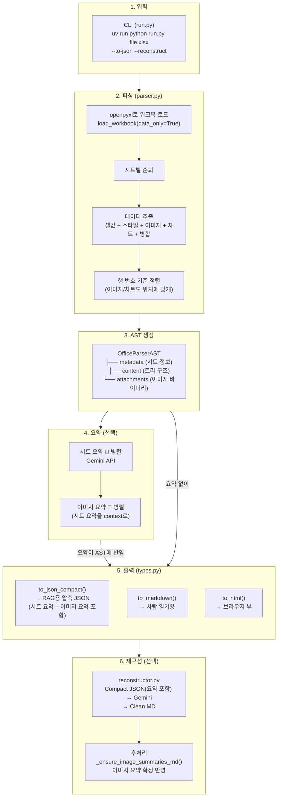

# Excel Parser Workflow Guide

> 이 문서는 Excel(.xlsx) 파일을 파싱하여 RAG용 Compact JSON, Markdown, HTML로 변환하는 전체 파이프라인을 설명합니다.
> 팀원이 코드를 처음 접할 때 이 문서를 먼저 읽으면 전체 흐름을 파악할 수 있습니다.

---

## 1. 한 줄 요약

```
Excel 파일 → openpyxl로 파싱 → AST(트리 구조) 생성 → 포맷별 출력(JSON/MD/HTML) → (옵션) Gemini로 재구성
```

---

## 2. 왜 이렇게 만들었나?

Excel은 단순한 표가 아닙니다. 실제 업무용 Excel은:
- 한 시트에 **여러 개의 표**가 섞여 있고
- **병합 셀**, **배경색으로만 구분되는 영역**이 있고
- **간트차트처럼 값 없이 색칠만 된 셀**이 있고
- **이미지, 차트**가 셀 사이에 끼어 있습니다

이걸 단순히 CSV로 변환하면 구조 정보가 전부 날아갑니다.
그래서 **AST(Abstract Syntax Tree)**라는 중간 표현을 거칩니다.

```
Excel의 복잡한 구조 → AST로 정규화 → 용도별 출력 포맷으로 변환
```

이 구조 덕분에 파싱 로직은 한 번만 작성하고, 출력 포맷(MD, HTML, JSON)은 독립적으로 추가할 수 있습니다.

---

## 3. 전체 파이프라인



---

## 4. 각 단계 상세 설명

### 4-1. 입력 (run.py)

CLI에서 파일 경로와 옵션을 받습니다.

```bash
# 기본: Markdown 출력
uv run python run.py docs/sample.xlsx -o output

# Compact JSON 출력 (RAG용)
uv run python run.py docs/sample.xlsx -o output --to-json

# JSON + Gemini 재구성 (clean MD 생성)
uv run python run.py docs/sample.xlsx -o output --to-json --reconstruct

# 요약 비활성화 (API 호출 없이 빠르게)
uv run python run.py docs/sample.xlsx -o output --to-json --no-summary
```

| 옵션 | 설명 |
|---|---|
| `--to-json` | RAG 최적화 Compact JSON 출력 |
| `--to-html` | 스타일 포함 HTML 출력 |
| `--to-markdown` | Markdown 출력 (기본값) |
| `--to-text` | 플레인 텍스트 출력 |
| `--reconstruct` | Compact JSON 기반으로 Gemini가 clean MD 재생성 |
| `--no-summary` | Gemini 요약 비활성화 |
| `--model-id` | 사용할 Gemini 모델 (기본: gemini-2.5-flash) |
| `-v` | DEBUG 로깅 활성화 (log/ 디렉토리에 파일 저장) |

---

### 4-2. 파싱 (parser.py → `_parse_xlsx()`)

Excel 파일을 열고 시트별로 데이터를 추출합니다.

#### 시트별로 하는 일 (순서대로):

**① 이미지 추출**
```
ws._images 순회
→ 포맷(png/jpg), 앵커 위치(row, col), 바이너리 데이터 추출
→ 파일명 생성: {시트명}_image_{번호}.{확장자}
→ attachments 리스트에 저장
```

**② 차트 추출**
```
ws._charts 순회
→ 차트 타입(BarChart, LineChart...), 제목, 앵커 위치 추출
```

**③ 테마 색상 추출**
```
워크북의 theme XML에서 색상 팔레트 추출
→ 테마 인덱스 → #RRGGBB 변환 시 사용
   (Excel은 인덱스 0↔1, 2↔3을 교차 매핑하는 특이한 구조)
```

**④ 병합 셀 처리**
```
ws.merged_cells.ranges 순회
→ 주 셀: colspan 값 기록
→ 나머지 셀: 스킵 마킹 (merged_spans[(row, col)] = 0)
```

**⑤ 셀 데이터 추출** (핵심!)
```
ws.iter_rows() 순회
→ 각 셀마다:
   - 값(text) 추출
   - 스타일 추출: 배경색, 글자색, 볼드
   - 병합 스킵 셀은 건너뜀
   - 뒤쪽 빈 셀 제거 (값도 없고 배경색도 없는 셀)
```

> **중요:** 값이 없더라도 배경색이 있으면 유효한 셀로 취급합니다.
> 이유: 간트차트에서 진행 상태를 색칠로만 표현하는 패턴이 많기 때문입니다.

> **어두운 배경 + 어두운 글자** 조합은 자동으로 흰색 글자로 보정합니다.
> (`_luminance()` 함수로 밝기 계산 → 둘 다 < 0.4이면 글자색을 #FFFFFF로)

**⑥ 위치 기반 정렬**
```
이미지, 차트, 셀 행 → 모두 (row_index, node) 형태로 수집
→ row 기준 정렬
→ 결과: 이미지와 차트가 원래 Excel 위치에 맞게 행 사이에 끼어들어감
```

---

### 4-3. AST 구조 (types.py)

파싱 결과는 **트리 구조**로 저장됩니다. 이것이 AST(Abstract Syntax Tree)입니다.

#### AST가 뭔가요?

컴파일러에서 소스 코드를 트리로 표현하듯이, 우리는 **Excel의 구조를 트리로 표현**합니다.
이 트리는 "어떤 포맷으로든 변환 가능한 중립적 표현"입니다.

#### 클래스 구조

```
OfficeParserAST (최상위)
├── type: "xlsx"
├── metadata: OfficeMetadata
│   ├── title, author, created, modified
│   └── document_summary (Gemini 요약)
├── content: List[OfficeContentNode]  ← 트리의 본체
└── attachments: List[OfficeAttachment]  ← 이미지 바이너리
```

#### OfficeContentNode (트리의 노드)

모든 콘텐츠는 이 하나의 타입으로 표현됩니다. `type` 필드로 종류를 구분합니다.

```python
@dataclass
class OfficeContentNode:
    type: str           # "sheet" | "row" | "cell" | "image" | "chart" | ...
    text: str           # 셀 값, 문단 텍스트 등
    children: List      # 하위 노드 (sheet→row→cell 계층)
    formatting: TextFormatting  # bold, italic 등
    metadata: Dict      # row번호, col번호, style, summary 등
```

#### Excel AST의 트리 구조 예시

```
OfficeParserAST (type="xlsx")
│
├── content[0]: sheet (sheetName="WBS공정표")
│   │
│   ├── row (r=1)
│   │   ├── cell (col=1, text="범례")
│   │   ├── cell (col=2, text="완료", bg="#00B050")
│   │   ├── cell (col=3, text="진행중", bg="#FFC000")
│   │   └── cell (col=4, text="지연", bg="#FF0000")
│   │
│   ├── row (r=3)  ← 헤더행
│   │   ├── cell (col=1, text="No", bg="#2F5496")
│   │   ├── cell (col=2, text="단계", bg="#2F5496")
│   │   └── ...
│   │
│   ├── image (row=5, filename="WBS_image_0.png")
│   │
│   ├── row (r=4)
│   │   ├── cell (col=1, text="1")
│   │   ├── cell (col=2, text="기획")
│   │   ├── cell (col=3, text="요구사항 분석")
│   │   └── cell (col=7, bg="#00B050")  ← 값 없이 색칠만 (완료 표시)
│   │
│   └── chart (chartType="BarChart", title="매출 추이")
│
├── content[1]: sheet (sheetName="KPI 운영안")
│   └── ...
│
└── attachments
    ├── OfficeAttachment (filename="WBS_image_0.png", data=b"...")
    └── ...
```

#### metadata에 들어가는 주요 정보

| 노드 타입 | metadata 키 | 설명 |
|---|---|---|
| **sheet** | `sheetName`, `maxRow`, `maxColumn`, `sheet_summary` | 시트 기본 정보 + 요약 |
| **row** | `row` | Excel 행 번호 (1-based) |
| **cell** | `row`, `col`, `colspan`, `style` | 위치, 병합, 스타일 정보 |
| **image** | `row`, `col`, `format`, `filename`, `image_summary` | 이미지 위치와 요약 |
| **chart** | `chartType`, `title`, `row` | 차트 타입과 위치 |

#### style 객체 구조

```json
{
  "background-color": "#2F5496",
  "color": "#FFFFFF",
  "font-weight": "bold"
}
```

> `#FFFFFF`(흰색)과 `#000000`(검정) 배경은 의미 없는 기본값이므로 자동 제거됩니다.

---

### 4-4. 요약 파이프라인 (Gemini API)

`--no-summary`를 주지 않으면 자동으로 실행됩니다.

```
Step 1: 시트 요약 (병렬)
  각 시트의 텍스트를 추출 → Gemini에게 3-5문장 요약 요청
  → sheet.metadata["sheet_summary"]에 저장

Step 2: 이미지 요약 (병렬, Step 1 완료 후)
  이미지 바이너리 + 시트 요약(context) → Gemini Vision에게 설명 요청
  → image.metadata["image_summary"]에 저장
```

**의존성 체인:**
```
시트 요약 ──(context로 전달)──→ 이미지 요약
```

시트 요약이 먼저 완료되어야 이미지 요약에 context로 전달할 수 있습니다.
예: "이 시트는 KPI 운영안에 대한 내용입니다" → 이미지를 더 정확하게 설명

---

### 4-5. 출력 포맷

AST에서 3가지 포맷으로 변환됩니다. 모두 `types.py`의 메서드입니다.

#### `to_json_compact()` — RAG용 (권장)

```json
{
  "type": "xlsx",
  "sheets": [{
    "sheet_name": "WBS공정표",
    "summary": "WBS 공정표 시트 요약...",
    "rows": [
      {"r": 4, "cells": {"1": "1", "2": "기획", "3": "요구사항 분석"}, "bg": {"7": "#00B050"}},
      {"r": 5, "cells": {"1": "1.1", "3": "이해관계자 인터뷰"}, "bg": {"7": "#00B050"}, "cs": {"2": 3}},
      {"type": "image", "filename": "WBS_image_0.png", "summary": "이미지 요약..."}
    ]
  }]
}
```

**특징:**
- 빈 셀 완전 제거 → 토큰 절약
- col 번호 기반 매핑 → 열 밀림 없음 (헤더 감지 불필요)
- 배경색 별도 `bg` 객체로 분리, colspan은 `cs` 객체로 분리
- 시트 요약(`summary`), 이미지 요약(`summary`) 포함
- 이미지/차트 노드가 rows 배열 내 위치에 맞게 삽입
- LLM이 구조를 정확하게 이해할 수 있는 형태

**왜 헤더를 key로 안 쓰나요?**

한 시트에 여러 표가 있으면 헤더가 여러 개입니다.
헤더를 key로 쓰면 첫 번째 표의 헤더가 나머지 표에 잘못 적용됩니다.
col 번호는 절대 틀리지 않으므로 더 안전합니다.

#### `to_markdown()` — 사람 읽기용

```markdown
## WBS공정표
| 범례 | 완료 | 진행중 | 지연 | 계획 | | | | ...
```

파이프 테이블 형식. 빈 셀이 `|  |`로 남아서 노이즈가 있지만 사람이 읽기엔 충분합니다.

#### `to_html()` — 브라우저 뷰

CSS 테마 포함 완성 HTML. 인라인 스타일로 원본 배경색/글자색 유지.

---

### 4-6. 재구성 (reconstructor.py) — 선택 옵션

`--reconstruct` 플래그를 주면 **Compact JSON을 Gemini에게 보내서 깔끔한 MD/HTML로 재생성**합니다.

```
Compact JSON (col 기반, 구조 정확, 이미지 요약 포함)
    ↓ Gemini 2.5 Flash (시트별 병렬)
    ↓
Gemini 출력 (MD/HTML)
    ↓ 후처리: _ensure_image_summaries_md()
    ↓  ├── Gemini가 이미지 출력함 → alt text를 image_summary로 교체
    ↓  └── Gemini가 이미지 누락함 → 문서 끝에 summary와 함께 추가
    ↓
Clean MD (빈 셀 제거, 테이블 분리, 계층 구조 표현, 이미지 요약 확정 반영)
Clean HTML (스타일링, rowspan/colspan) ※ 이미지 요약 후처리 미적용
```

**프롬프트는 `prompts.yaml`에 관리됩니다.** 프롬프트를 수정하면 재구성 품질을 튜닝할 수 있습니다.

**Gemini가 하는 일:**
1. 한 시트의 여러 표를 의미 단위로 분리
2. 간트 배경색 → 주변 범례를 참조하여 텍스트 상태 변환 (예: `#00B050` → "완료")
3. 계층 구조를 들여쓰기/리스트로 표현
4. 빈 행/구분 행/의미없는 구분선 삭제
5. 가상 병합 처리 (반복값 → 첫 번째만 유지)
6. 원본 언어 유지 (번역하지 않음)
7. 청킹/임베딩을 고려한 Semantic 구조 출력
8. 불필요한 설명 문구 없이 변환된 결과만 출력

**이미지 요약 후처리 (`_ensure_image_summaries_md`):**

Gemini 출력에만 의존하면 이미지 요약이 누락될 수 있으므로, 후처리로 확정적으로 반영합니다.

| 상황 | 처리 |
|---|---|
| Gemini가 `` 출력 | alt text를 `image_summary`로 교체 |
| Gemini가 이미지를 누락 | 문서 끝에 `` 추가 |
| `--no-summary` (요약 없음) | alt text = "이미지" (기본값) |

> **참고:** 현재 이 후처리는 MD 재구성에만 적용됩니다. HTML 재구성에는 미적용 상태입니다.

---

## 5. 출력 디렉토리 구조

```
output/{파일명}/
├── {파일명}.json                    # Compact JSON (RAG 소스) — --to-json
├── {파일명}.md                      # Raw Markdown — --to-markdown (기본값)
├── {파일명}.html                    # Styled HTML — --to-html
├── {파일명}.txt                     # 플레인 텍스트 — --to-text
├── {파일명}_reconstructed.md        # Gemini 재구성 MD — --reconstruct
└── pictures/                        # 추출된 이미지
    ├── {시트명}_image_0.png
    └── ...
```

> **참고:** 출력 포맷은 하나만 선택됩니다 (json/md/html/text 중 하나). `--reconstruct`는 선택된 포맷과 별도로 `_reconstructed.md`를 추가 생성합니다.

---

## 6. 포맷별 비교 (실측)

demo_irregular_v2.xlsx (1시트, WBS+매출+비용+의견 4개 표) 기준:

| 포맷 | 토큰 수 | 빈 셀 | 구조 정확도 | 용도 |
|---|---:|---|---|---|
| Raw MD | 2,575 | ~40% 빈 셀 패딩 | 테이블 파편화 | 사람 읽기 |
| Compact JSON | 3,826 | 0% (전부 제거) | col 위치 정확 | RAG 입력 / LLM 입력 |
| HTML | 9,355 | 스타일 오버헤드 | 시각적 완벽 | 브라우저 뷰 |
| Reconstructed MD | ~900 | 0% | Gemini가 정리 | RAG 최종 소스 |

---

## 7. "가짜 병합" 패턴

Excel에서 실제 셀 병합(`ws.merged_cells`)을 쓰지 않고 시각적으로 병합처럼 보이게 하는 패턴이 3가지 있습니다. 파서가 모두 처리합니다.

| 패턴 | 예시 | 처리 방법 |
|---|---|---|
| **빈 셀 그룹핑** | "모니터링" + 빈칸 2개 | JSON에서 빈 셀 자동 제거 → LLM이 문맥으로 이해 |
| **흰색 글씨 반복** | "2. 정확도" × 16행 (font color = #FFFFFF) | 파서는 그대로 추출, Gemini reconstruct 시 중복 제거 |
| **배경색만 연속** | 오렌지 좌측 바 (값 없음) | `bg` 필드로 보존 → reconstruct 시 섹션 구분 힌트 |

---

## 8. 에러 처리

파서는 **부분 실패를 허용**합니다. 하나가 실패해도 나머지는 계속 진행합니다.

| 실패 상황 | 동작 |
|---|---|
| 이미지 바이너리 추출 실패 | 노드는 생성, 요약만 스킵 |
| 차트 제목 파싱 실패 | title = None, chartType만 기록 |
| 셀 스타일 추출 실패 | style = None으로 진행 |
| Gemini 요약 실패 | 해당 요약만 스킵, 로그 경고 |
| 테마 색상 추출 실패 | 빈 리스트로 진행 (테마색 무시) |
| Reconstruct 시트 실패 | 해당 시트만 `<!-- Reconstruct failed -->` 처리, 나머지 시트는 정상 진행 |
| Reconstruct 전체 실패 | 로그 에러, 재구성 MD 미생성 (원본 출력은 영향 없음) |

---

## 9. 파일별 역할 요약

| 파일 | 역할 |
|---|---|
| `run.py` | CLI 진입점. 인자 파싱, PDF/Office 분기 |
| `office_parser/parser.py` | Excel/Word/PPT 파싱 핵심 로직. `_parse_xlsx()` |
| `office_parser/types.py` | AST 타입 정의 + 출력 변환 (`to_json_compact`, `to_markdown`, `to_html`) |
| `office_parser/worker.py` | 단일 파일 처리 + 출력 저장 + reconstruct 호출 |
| `office_parser/reconstructor.py` | Gemini 기반 JSON→MD/HTML 재구성 |
| `office_parser/prompts.yaml` | reconstruct용 프롬프트 관리 |
